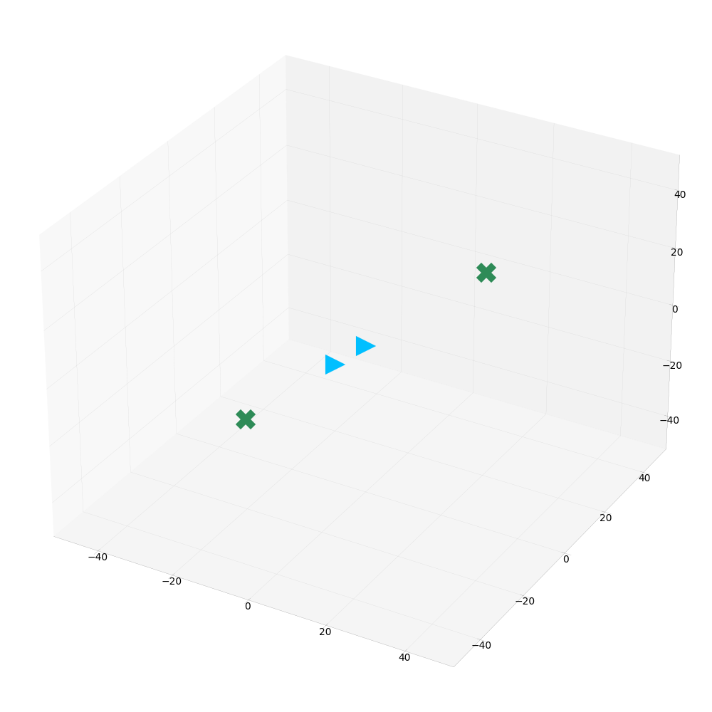
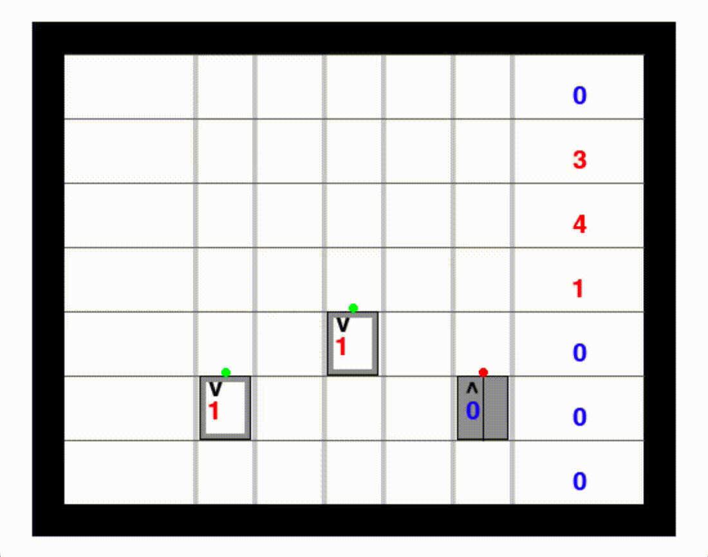
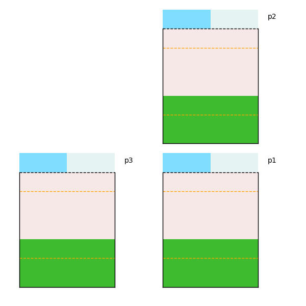
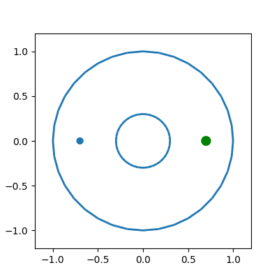
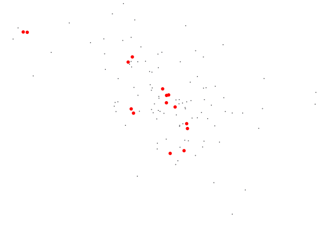
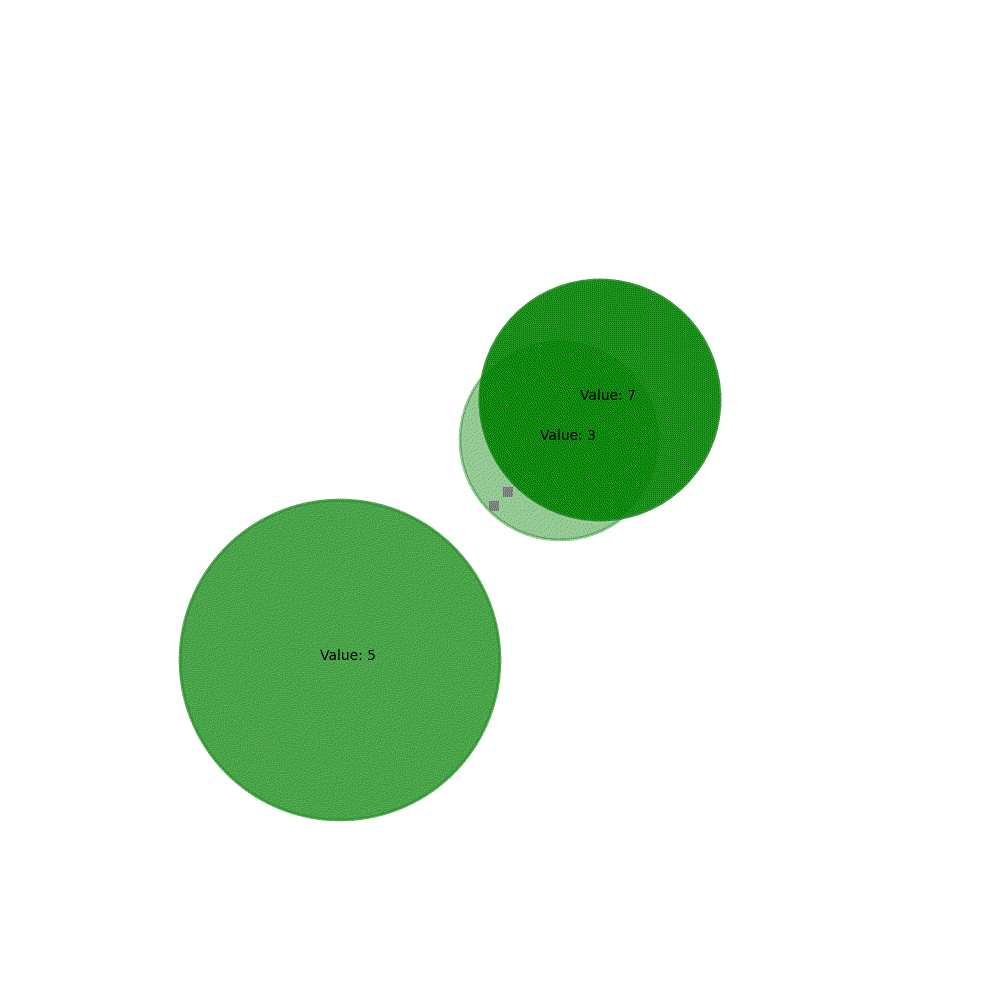
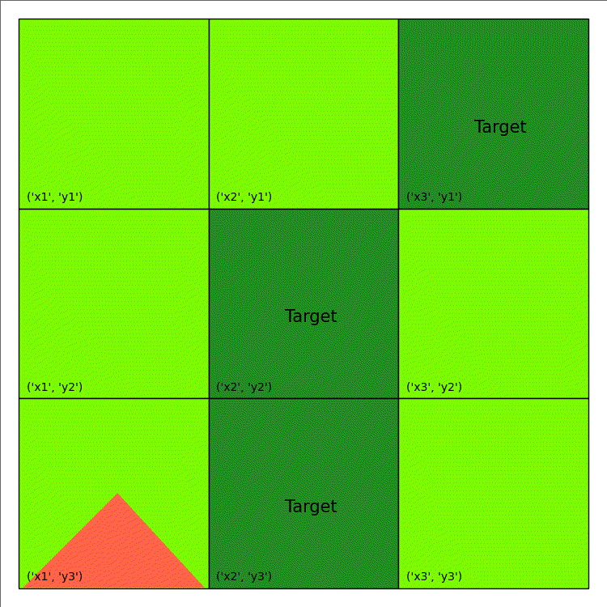

# pyRDDLGym

A Python toolkit for auto-generation of OpenAI Gym environments from Relational Dynamic Influence Diagram Language (RDDL) description files.
This is currently the official parser, simulator and evaluation system for RDDL in Python, with new features and enhancements to the RDDL language.<br />

<p align="center">





</p>
<p align="center">





</p>


## Purpose and Benefits

* Describe your environment in RDDL ([web-based intro](https://ataitler.github.io/IPPC2023/pyrddlgym_rddl_tutorial.html)), ([full tutorial](https://github.com/ataitler/pyRDDLGym?tab=readme-ov-file#tutorial)), ([language spec](https://pyrddlgym.readthedocs.io/en/latest/rddl.html)) and use it with your existing workflow for OpenAI gym environments
* Compact, easily modifiable representation language for discrete time control in dynamic stochastic environments
    * e.g., [a few lines of RDDL](https://github.com/ataitler/pyRDDLGym/blob/main/pyRDDLGym/Examples/CartPole/Continuous/domain.rddl#L61) for CartPole vs. [200 lines in direct Python for Gym](https://github.com/openai/gym/blob/master/gym/envs/classic_control/cartpole.py#L130)
* Object-oriented relational (template) specification allows easy scaling of model instances from 1 object to 1000's of objects without changing the domain model
    * e.g., [Wildfire](https://ataitler.github.io/IPPC2023/pyrddlgym_rddl_tutorial.html), [Reservoir Control](https://colab.research.google.com/drive/19O-vgPsEX7t32cqV0bABmAdRaSWSMa4g?usp=sharing)
* Out-of-the-box planners 
    * [JaxPlan](https://pyrddlgym.readthedocs.io/en/latest/jax.html): Planning through autodifferentiation
    * [GurobiPlan](https://pyrddlgym.readthedocs.io/en/latest/gurobi.html): Planning through mixed discrete-continuous optimization
    * [PROST](https://pyrddlgym.readthedocs.io/en/latest/prost.html): Monte Carlo Tree Search (MCTS)
    * [Stable Baselines RL (DQN, PPO, etc.)](https://pyrddlgym.readthedocs.io/en/latest/sb.html): Popular Reinforcement Learning (RL) algorithms
    * [Symbolic Dynamic Programming](https://github.com/ataitler/pyRDDLGym/tree/sdp/pyRDDLGym/Solvers/SDP): Exact Symbolic Regression-based planning
* Customizable [visualization](https://pyrddlgym.readthedocs.io/en/latest/start.html#visualization) and [recording](https://pyrddlgym.readthedocs.io/en/latest/start.html#recording-movies) tools facilitate domain debugging and plan interpretation
    * e.g., a student course project [visualizing Jax plans](https://github.com/CowboyTime/CISC813-Project-USV-Nav/blob/main/CISC813%20Gifs/V2_5Moving_2.gif) in a [sailing domain](https://github.com/CowboyTime/CISC813-Project-USV-Nav/blob/main/Version2/USV_obstacle_nav_v2_Domain.rddl)
* Compiler tools to extract [Dynamic Bayesian Networks (DBNs)](https://ataitler.github.io/IPPC2023/dbn.html) and [Extended Algebraic Decision Diagrams (XADDs)](https://ataitler.github.io/IPPC2023/xadd.html) for symbolic analysis of causal dependencies and transition distributions
* Runs out-of-the-box in [Python](https://github.com/ataitler/pyRDDLGym?tab=readme-ov-file#installation) or within [Colab](https://colab.research.google.com/drive/19O-vgPsEX7t32cqV0bABmAdRaSWSMa4g?usp=sharing)


## Paper

Please see our [paper](https://arxiv.org/abs/2211.05939) describing pyRDDLGym. If you found this useful, please consider citing us:

```
@article{taitler2022pyrddlgym,
      title={pyRDDLGym: From RDDL to Gym Environments},
      author={Taitler, Ayal and Gimelfarb, Michael and Gopalakrishnan, Sriram and Mladenov, Martin and Liu, Xiaotian and Sanner, Scott},
      journal={arXiv preprint arXiv:2211.05939},
      year={2022}}
```

## Tutorial

This toolkit was the official evaluation system of the [2023 IPC RL and planning track](https://ataitler.github.io/IPPC2023/).

Please see the following slides and notebook which were given as a tutorial at ICAPS 2023:
* [Part 1 slides](https://pyrddlgym-project.github.io/data/Tutorial/ICAPS2023/RDDL_Tutorial_ICAPS_2023_Part_1.pdf)
* [Part 2 slides](https://pyrddlgym-project.github.io/data/Tutorial/ICAPS2023/RDDL_Tutorial_ICAPS_2023_Part_2.pdf)
* [Tutorial notebook](https://colab.research.google.com/drive/19O-vgPsEX7t32cqV0bABmAdRaSWSMa4g?usp=sharing)
* [Playground notebook](https://colab.research.google.com/drive/1XjPnlujsJPNUqhHK5EuWSVWQY2Pvxino?usp=sharing)
<!---* [Tutorial notebook](https://colab.research.google.com/drive/1wdX0MbjmjpC7NvBRFlTQ8kvi1uuTCQaK?usp=sharing) --->

## Status

A number of representative RDDL environments are included with pyRDDLGym:
* Continuous/discrete cart-pole control
* Continuous/discrete mountain-car control
* Elevator control
* Mars rover control
* Power generation
* Race car control
* Recommendation system
* Continuous/discrete/mixed UAV control
* Quadcopter control
* Forest fire control
* Traffic control

A complete archive of past and present RDDL problems, including all IPPC problems, is also available to clone\pip
* [rddlrepository](https://github.com/ataitler/rddlrepository) (`pip install rddlrepository`)

Software for related simulators:
* [rddlsim](https://github.com/ssanner/rddlsim)
* [rddlgym](https://github.com/thiagopbueno/rddlgym)
* [pddlgym](https://github.com/tomsilver/pddlgym)

The parser used in this project is based on the parser from 
Thiago Pbueno's [pyrddl](https://github.com/thiagopbueno/pyrddl)
(used in [rddlgym](https://github.com/thiagopbueno/rddlgym)).

## Installation

### Requirements
We require Python 3.8+.

As well, the following packages are prerequisite:
* ply
* pillow>=9.2.0
* numpy>=1.22
* matplotlib>=3.5.0
* gym>=0.24.0
* pygame

To run the JAX planner, the following additional packages are required:
* tqdm
* jax>=0.3.25
* optax>=0.1.4
* dm-haiku>=0.0.9
* tensorflow>=2.11.0
* tensorflow-probability>=0.19.0

To run the Gurobi planner, you will need to obtain a valid Gurobi license. 
Then, follow the instructions [here](https://support.gurobi.com/hc/en-us/articles/360044290292-How-do-I-install-Gurobi-for-Python-). We require Gurobi 10+.

To run the stable-baselines3 in pyRDDLGym, you will need this package along with any of its requirements.

### Installing via pip
pip install pyRDDLGym

### Known issues
There are two known issues not documented with RDDL:
1. the minus (-) arithmetic operation must have spaces on both sides,
otherwise there is ambiguity whether it refers to a mathematical operation or to variables
2. aggregation-union-precedence parsing requires for encapsulating parentheses around aggregations, e.g., (sum_{}[]).

## Usage examples
The two main imports are the environment object and the ExampleManager.
In addition, we supply two simple agents, to illustrate interaction with the environment.
```python
from pyRDDLGym import RDDLEnv
from pyRDDLGym import ExampleManager
from pyRDDLGym.Core.Policies.Agents import RandomAgent
```

The list of examples can be obtained through the ExampleManager object:
```python
ExampleManager.ListExamples()
```

And an instantiation of the ExampleManager with a specific example will give access to its information:
```python
# get the environment info
EnvInfo = ExampleManager.GetEnvInfo('MarsRover')
# access to the domain file
EnvInfo.get_domain()
#list all available instances for that domain
EnvInfo.list_instances()
# access to instance 0  
EnvInfo.get_instance(0)
# obtain the dedicated visualizer object of the domain if exists
EnvInfo.get_visualizer()
```

An environment can be initialized by *.rddl files directly or by the ExampleManager:
```python
# set up the environment class, choose instance 0 because every example has at least one example instance
env = RDDLEnv.RDDLEnv(domain=EnvInfo.get_domain(), instance=EnvInfo.get_instance(0))
# set up the environment visualizer
env.set_visualizer(EnvInfo.get_visualizer())
```

An agent can be initialized:
```python
agent = RandomAgent(action_space=env.action_space, num_actions=env.numConcurrentActions)
```

And the interaction with the environment is identical to the OpenAI gym interaction:
```python
total_reward = 0
state = env.reset()
for step in range(env.horizon):
    env.render()
    action = agent.sample_action(state)
    next_state, reward, done, info = env.step(action)
    print(f'state = {state}, action = {action}, reward = {reward}')
    total_reward += reward
    state = next_state
    if done:
        break
print(f'episode ended with reward {total_reward}')

# release all viz resources, and finish logging if used
env.close()
```

__Note__: the _rddlrepository_ package contains an example manager similar to the one included with pyRDDLGym.
It is possible (and encouraged!) to `import rddlrepository.Manager.RDDLRepoManager` and use it in a similar manner to the pyRDDLGym example manager to access the full RDDL problems archive. 

### Observations and actions representation
All observations (POMDP), states (MDP) and actions are represented by dictionary objects, 
whose keys correspond to the appropriate fluents as defined in the RDDL description.

### Writing custom problems
Writing new OpenAI gym environments only requires knowledge of RDDL, thus no Python coding is required!
1. create RDDL file for the domain description
2. create RDDL file for the non-fluents and instance
3. (optional) create a custom visualizer, by inheriting from pyRDDL.Visualizer.StateViz.

Now the instantiation of the environment for the newly written problem is done as:
```python
env = RDDLEnv.RDDLEnv(domain=<domain path>, instance=<instance path>)
# set up the environment visualizer
env.set_visualizer(<visualizer object>)
```

## License
This software is distributed under the MIT License.

## Contributors
- Michael Gimelfarb (University of Toronto, CA)
- Jihwan Jeong (University of Toronto, CA)
- Sriram Gopalakrishnan (Arizona State University/J.P. Morgan, USA)
- Martin Mladenov (Google, BR)
- Jack Liu (University of Toronto, CA)
