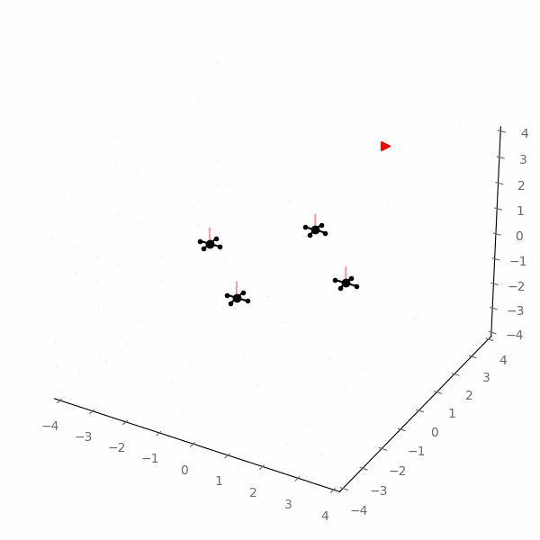

<p align="center">

</p>

# pyRDDLGym

> [!WARNING]  
> As of Feb 9, 2024, the pyRDDLGym API has been updated to version 2.0, and is no longer backwards compatible with the previous stable version 1.4.4.
> While we strongly recommend that you update to 2.0, in case you require the old API, you can install the last stable version with pip:
> ``pip install pyRDDLGym==1.4.4``, or directly from github ``pip install git+https://github.com/pyrddlgym-project/pyRDDLGym@version_1.4.4_stable``.

A Python toolkit for auto-generation of OpenAI Gym environments from Relational Dynamic Influence Diagram Language (RDDL) description files.
This is currently the official parser, simulator and evaluation system for RDDL in Python, with new features and enhancements to the RDDL language.<br />

<p align="center">


</p>
<p align="center">



</p>

## Contents
- [Purpose and Benefits](#purpose-and-benefits)
- [Installation](#installation)
- [Usage](#usage)
   - [Running the Example](#running-the-example)
   - [Loading an Environment](#loading-an-environment)
   - [Creating your Own Visualizer](#creating-your-own-visualizer)
   - [Recording Movies](#recording-movies)
   - [Interacting with an Environment](#interacting-with-an-environment)
- [Status](#status)
- [Citing pyRDDLGym](#citing-pyrddlgym)
- [License](#license)
- [Contributors](#contributors)

## Purpose and Benefits

* Describe your environment in RDDL ([web-based intro](https://ataitler.github.io/IPPC2023/pyrddlgym_rddl_tutorial.html)), ([full tutorial](https://pyrddlgym-project.github.io/AAAI24-lab)), ([language spec](https://pyrddlgym.readthedocs.io/en/latest/rddl.html)) and use it with your existing workflow for OpenAI gym environments
* Compact, easily modifiable representation language for discrete time control in dynamic stochastic environments
    * e.g., [a few lines of RDDL](https://github.com/pyrddlgym-project/rddlrepository/blob/main/rddlrepository/archive/standalone/CartPole/Continuous/domain.rddl#L61) for CartPole vs. [200 lines in direct Python for Gym](https://github.com/openai/gym/blob/master/gym/envs/classic_control/cartpole.py#L130)
* Object-oriented relational (template) specification allows easy scaling of model instances from 1 object to 1000's of objects without changing the domain model
    * e.g., [Wildfire (Web Tutorial)](https://ataitler.github.io/IPPC2023/pyrddlgym_rddl_tutorial.html), [Reservoir Control (Colab Tutorial)](https://colab.research.google.com/drive/19O-vgPsEX7t32cqV0bABmAdRaSWSMa4g?usp=sharing)
* Customizable [visualization](https://github.com/ataitler/pyRDDLGym?tab=readme-ov-file#creating-your-own-visualizer) and [recording](https://github.com/ataitler/pyRDDLGym?tab=readme-ov-file#recording-movies) tools facilitate domain debugging and plan interpretation
    * e.g., a student course project [visualizing Jax plans](https://github.com/CowboyTime/CISC813-Project-USV-Nav/blob/main/CISC813%20Gifs/V2_5Moving_2.gif) in a [sailing domain](https://github.com/CowboyTime/CISC813-Project-USV-Nav/blob/main/Version2/USV_obstacle_nav_v2_Domain.rddl)
* Runs out-of-the-box in [Python](https://github.com/ataitler/pyRDDLGym?tab=readme-ov-file#installation) or within [Colab (RDDL Playground)](https://colab.research.google.com/drive/1XjPnlujsJPNUqhHK5EuWSVWQY2Pvxino?usp=sharing)
* Compiler tools to extract [Dynamic Bayesian Networks (DBNs)](https://github.com/pyrddlgym-project/pyRDDLGym-symbolic?tab=readme-ov-file#visualizing-dbns-with-xadd) and [Extended Algebraic Decision Diagrams (XADDs)](https://github.com/pyrddlgym-project/pyRDDLGym-symbolic?tab=readme-ov-file#xadd-compilation-of-cpfs) for symbolic analysis of causal dependencies and transition distributions
* Ready to use with out-of-the-box planners:
    * [JaxPlan](https://github.com/pyrddlgym-project/pyRDDLGym-jax): Planning through autodifferentiation
    * [GurobiPlan](https://github.com/pyrddlgym-project/pyRDDLGym-gurobi): Planning through mixed discrete-continuous optimization
    * [PROST](https://github.com/pyrddlgym-project/pyRDDLGym-prost): Monte Carlo Tree Search (MCTS)
    * [Deep Reinforcement Learning (DQN, PPO, etc.)](https://github.com/pyrddlgym-project/pyRDDLGym-rl): Popular Reinforcement Learning (RL) algorithms from Stable Baselines and RLlib
    * [Symbolic Dynamic Programming](https://github.com/pyrddlgym-project/pyRDDLGym-symbolic): Exact Symbolic regression-based planning and policy evaluation
  
## Installation

We require Python 3.8+ and the following packages: ``ply``, ``pillow>=9.2.0``, ``numpy>=1.22``, ``matplotlib>=3.5.0``, ``gymnasium``, ``pygame``, ``termcolor``.
You can install our package, along with all of its prerequisites, using pip

```shell
pip install pyRDDLGym
```

Since pyRDDLGym does not come with any premade environments, you can either load RDDL documents from your local file system, or install rddlrepository for easy access to preexisting domains

```shell
pip install rddlrepository
```

## Usage

### Running the Example

pyRDDLGym comes with several run scripts as starting points for you to use in your own scripts.
To simulate an environment, from the install directory of pyRDDLGym, type the following into a shell supporting the python command (you need rddlrepository):

```shell
python -m pyRDDLGym.examples.run_gym "Cartpole_Continuous" "0" 1
```

which loads instance "0" of the CartPole control problem with continuous actions from rddlrepository and simulates it with a random policy for one episode.


### Loading an Environment

Instantiation of an existing environment by name is as easy as:

```python
import pyRDDLGym
env = pyRDDLGym.make("Cartpole_Continuous", "0")
```

Loading your own domain files is just as straightforward

```python
import pyRDDLGym
env = pyRDDLGym.make("/path/to/domain.rddl", "/path/to/instance.rddl")
```

Both versions above instantiate ``env`` as an OpenAI gym environment, so that the usual ``reset()`` and ``step()`` calls work as intended.

You can also pass custom settings to the make command, i.e.:

```python
import pyRDDLGym
env = pyRDDLGym.make("Cartpole_Continuous", "0", enforce_action_constraints=True, ...)
```

### Creating your Own Visualizer

You can design your own visualizer by subclassing from ``pyRDDLGym.core.visualizer.viz.BaseViz`` and overriding the ``render(state)`` method.
Then, changing the visualizer of the environment is easy

```python
viz_class = ...   # the class name of your custom viz
env.set_visualizer(viz_class)
```

### Recording Movies

You can record an animated gif or movie of the agent interaction with an environment (described below). To do this, simply pass a ``MovieGenerator`` object to the ``set_visualizer`` method:

```python
from pyRDDLGym.core.visualizer.movie import MovieGenerator
movie_gen = MovieGenerator("/path/where/to/save", "env_name")
env.set_visualizer(viz_class, movie_gen=movie_gen)
```

### Interacting with an Environment

Agents map states to actions through the ``sample_action(obs)`` function, and can be used to interact with an environment. 
For example, to initialize a random agent:

```python
from pyRDDLGym.core.policy import RandomAgent
agent = RandomAgent(action_space=env.action_space, num_actions=env.max_allowed_actions)
```

All agent instances support one-line evaluation in a given environment:

```python
stats = agent.evaluate(env, episodes=1, verbose=True, render=True)
```

which returns a dictionary of summary statistics (e.g. "mean", "std", etc...), and which also visualizes the domain in real time. 
Of course, if you wish, the standard OpenAI gym interaction is still available to you:

```python
total_reward = 0
state, _ = env.reset()
for step in range(env.horizon):
    env.render()
    action = agent.sample_action(state)
    next_state, reward, terminated, truncated, _ = env.step(action)
    print(f'state = {state}, action = {action}, reward = {reward}')
    total_reward += reward
    state = next_state
    done = terminated or truncated
    if done:
        break
print(f'episode ended with reward {total_reward}')

# release all viz resources, and finish logging if used
env.close()
```

> [!NOTE]  
> All observations (for a POMDP), states (for an MDP) and actions are represented by ``dict`` objects, whose keys correspond to the appropriate fluents as defined in the RDDL description.
> Here, the syntax is ``pvar-name___o1__o2...``, where ``pvar-name`` is the pvariable name, followed by 3 underscores, and object parameters ``o1``, ``o2``... are separated by 2 underscores.

> [!WARNING] 
> There are two known issues not documented with RDDL:
> 1. the minus (-) arithmetic operation must have spaces on both sides, otherwise there is ambiguity whether it refers to a mathematical operation or to variables
> 2. aggregation-union-precedence parsing requires for encapsulating parentheses around aggregations, e.g., (sum_{}[]).

## Status

A complete archive of past and present RDDL problems, including all IPPC problems, is also available to clone\pip
* [rddlrepository](https://github.com/pyRDDLGym-project/rddlrepository) (``pip install rddlrepository``)

Software for related simulators:
* [rddlsim](https://github.com/ssanner/rddlsim)
* [rddlgym](https://github.com/thiagopbueno/rddlgym)
* [pddlgym](https://github.com/tomsilver/pddlgym)

The parser used in this project is based on the parser from 
Thiago Pbueno's [pyrddl](https://github.com/thiagopbueno/pyrddl)
(used in [rddlgym](https://github.com/thiagopbueno/rddlgym)).

## Citing pyRDDLGym

Please see our [paper](https://arxiv.org/abs/2211.05939) describing pyRDDLGym. If you found this useful, please consider citing us:

```
@article{taitler2022pyrddlgym,
      title={pyRDDLGym: From RDDL to Gym Environments},
      author={Taitler, Ayal and Gimelfarb, Michael and Gopalakrishnan, Sriram and Mladenov, Martin and Liu, Xiaotian and Sanner, Scott},
      journal={arXiv preprint arXiv:2211.05939},
      year={2022}}
```

## License
This software is distributed under the MIT License.

## Contributors
- Michael Gimelfarb (University of Toronto, CA)
- Jihwan Jeong (University of Toronto, CA)
- Sriram Gopalakrishnan (Arizona State University/J.P. Morgan, USA)
- Martin Mladenov (Google, BR)
- Jack Liu (University of Toronto, CA)
