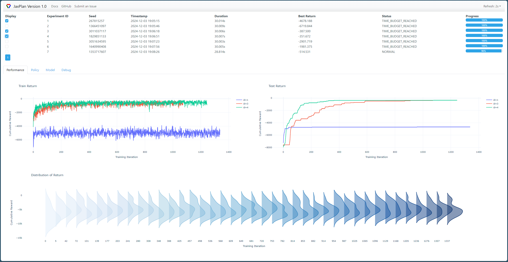

.. _jaxplan:

pyRDDLGym-jax: Gradient-Based Simulation and Planning with JaxPlan
===============

In this tutorial, we discuss how a RDDL model can be automatically compiled into a differentiable JAX simulator. 
We also show how pyRDDLGym-jax (or JaxPlan as it is referred to in the literature) leverages gradient-based optimization to build optimal controllers. 

Installing
-----------------

To install JaxPlan and all of its requirements via pip:

.. code-block:: shell

    pip install pyRDDLGym-jax[extra]

To install the latest pre-release version via git:

.. code-block:: shell

    pip install git+https://github.com/pyrddlgym-project/pyRDDLGym-jax.git

Simulating using JAX
-------------------

pyRDDLGym ordinarily simulates domains using pure Python and NumPy arrays.
If you require additional structure (e.g. gradient calculations) or better simulation performance, 
the environment can be compiled using JAX and replace the default simulation backend, as shown below:

.. code-block:: python
	
	import pyRDDLGym
	from pyRDDLGym_jax.core.simulator import JaxRDDLSimulator
	env = pyRDDLGym.make("CartPole_Continuous_gym", "0", backend=JaxRDDLSimulator)
	
.. note::
   All RDDL syntax (both new and old) is supported in the RDDL-to-JAX compiler. 
   In almost all cases, the JAX backend should return numerical results identical to the default backend.
   However, not all operations currently support gradient backpropagation (see the Limitations section).

Differentiable Planning in Deterministic Domains
-------------------

The (open-loop) planning problem for a deterministic environment involves finding a sequence of actions (plan)
that maximize accumulated reward over a fixed horizon

.. math::

	\max_{a_1, \dots a_T} \sum_{t=1}^{T} R(s_t, a_t), \quad s_{t + 1} = f(s_t, a_t)
	
If the state and action spaces are continuous, and f and R are differentiable functions, 
gradient ascent can optimize the actions as described 
`in this paper <https://proceedings.neurips.cc/paper/2017/file/98b17f068d5d9b7668e19fb8ae470841-Paper.pdf>`_.
Specifically, given learning rate :math:`\eta > 0`, gradient ascent updates the plan
:math:`a_\tau'` at decision epoch :math:`\tau` as

.. math::
	
	a_{\tau}' = a_{\tau} + \eta \sum_{t=1}^{T} \nabla_{a_\tau} R(s_t, a_t),
	
where the gradient of the reward at all times :math:`t \geq \tau` is computed via the chain rule:

.. math::

	\nabla_{a_{\tau}} R(s_t, a_t) = \frac{d R(s_t, a_t)}{d s_{t}} \frac{d f(s_\tau, a_\tau)}{d a_{\tau}} \prod_{k=\tau + 1}^{t-1}\frac{d f(s_k, a_k)}{d s_{k}} + \frac{d R(s_t, a_t)}{d a_{\tau}}.
	
In stochastic domains, an open-loop plan could be sub-optimal 
because it fails to correct for deviations in the state from its anticipated course.
One solution is to recompute the plan periodically or after each decision epoch, 
which is often called "replanning". An alternative approach is to learn a policy network 
:math:`a_t \gets \pi_\theta(s_t)` 
as explained `in this paper <https://ojs.aaai.org/index.php/AAAI/article/view/4744>`_. 
JaxPlan currently supports both options, which are detailed in a later section of this tutorial.

Differentiable Planning in Stochastic Domains
-------------------

A common problem of planning in stochastic domains is that the gradients of sampling nodes are not well-defined.
JaxPlan works around this problem by using the reparameterization trick.

To illustrate, we can write :math:`s_{t+1} = \mathcal{N}(s_t, a_t^2)` as :math:`s_{t+1} = s_t + a_t * \mathcal{N}(0, 1)`, 
although the latter is amenable to backpropagation while the first is not.
The reparameterization trick also works generally, assuming there exists a closed-form function f such that

.. math::

    s_{t+1} = f(s_t, a_t, \xi_t)
    
and :math:`\xi_t` are random variables drawn from some distribution independent of states and actions. 
For a detailed discussion of reparameterization in the context of planning, 
please see `this paper <https://ojs.aaai.org/index.php/AAAI/article/view/4744>`_ 
or `this paper <https://ojs.aaai.org/index.php/AAAI/article/view/21226>`_.

JaxPlan automatically performs reparameterization whenever possible. For some special cases,
such as the Bernoulli and Discrete distribution, it applies the Gumbel-softmax trick 
as described `here <https://arxiv.org/pdf/1611.01144.pdf>`_. 
Defining K independent samples from a standard Gumbel distribution :math:`g_1, \dots g_K`, we reparameterize the 
random variable :math:`X` with probability mass function :math:`p_1, \dots p_K` as

.. math::

    X = \arg\!\max_{i=1\dots K} \left(g_i + \log p_i \right)

where the argmax is approximated using the softmax function.

.. warning::
   For general non-reparameterizable distributions, the result of the gradient calculation 
   is fully dependent on the JAX implementation: it could return a zero or NaN gradient, or raise an exception.

Running JaxPlan from the Command Line
-------------------

A basic shell script is provided to run JaxPlan on any domain in rddlrepository:

.. code-block:: shell
    
    python -m pyRDDLGym_jax.examples.run_plan <domain> <instance> <method> <episodes>
    
where:

* ``<domain>`` is the domain identifier in rddlrepository, or a path pointing to a valid domain file
* ``<instance>`` is the instance identifier in rddlrepository, or a path pointing to a valid instance file
* ``<method>`` is the planning method to use (see below)
* ``<episodes>`` is the (optional) number of episodes to evaluate the final policy.

The ``<method>`` parameter warrants further explanation. Currently the script supports three possible modes:

* ``slp`` is the straight-line open-loop planner described `in this paper <https://proceedings.neurips.cc/paper/2017/file/98b17f068d5d9b7668e19fb8ae470841-Paper.pdf>`_
* ``drp`` is the deep reactive policy network described `in this paper <https://ojs.aaai.org/index.php/AAAI/article/view/4744>`_
* ``replan`` is the same as ``slp`` except it uses periodic replanning as described above.

For example, the following will perform open-loop control on the Quadcopter domain with 4 drones:

.. code-block:: shell

    python -m pyRDDLGym_jax.examples.run_plan Quadcopter 1 slp
   

Running JaxPlan from within Python
-------------------

.. _jax-intro:

JaxPlan provides convenient tools to automatically compile a RDDL description 
of a problem to an optimization problem. To initialize and run an open-loop controller:

.. code-block:: python

    import pyRDDLGym
    from pyRDDLGym_jax.core.planner import JaxStraightLinePlan, JaxBackpropPlanner, JaxOfflineController

    # set up the environment (note the vectorized option must be True)
    env = pyRDDLGym.make("domain", "instance", vectorized=True)

    # create the planning algorithm
    plan = JaxStraightLinePlan(**plan_args)
    planner = JaxBackpropPlanner(rddl=env.model, plan=plan, **planner_args)
    controller = JaxOfflineController(planner, **train_args)

    # evaluate the planner
    controller.evaluate(env, episodes=1, verbose=True, render=True)
    env.close()

To use periodic replanning, simply change the controller type to:

.. code-block:: python

    controller = JaxOnlineController(planner, **train_args)	

To use a deep reactive policy, simply change the ``plan`` type to:

.. code-block:: python

    plan = JaxDeepReactivePolicy(**plan_args)

.. note::
   All controllers are instances of pyRDDLGym's ``BaseAgent`` and support the ``evaluate()`` function. 

The ``**planner_args`` and ``**train_args`` are keyword arguments passed during initialization, 
but we strongly recommend creating and loading a configuration file as discussed next.

Configuring JaxPlan
-------------------

The recommended way to manage planner settings is to write a configuration file 
with all the necessary hyper-parameters. Below is a basic configuration file for straight-line planning:

.. code-block:: shell

    [Model]
    logic='FuzzyLogic'
    comparison_kwargs={'weight': 20}
    rounding_kwargs={'weight': 20}
    control_kwargs={'weight': 20}

    [Optimizer]
    method='JaxStraightLinePlan'
    method_kwargs={}
    optimizer='rmsprop'
    optimizer_kwargs={'learning_rate': 0.001}
    batch_size_train=1
    batch_size_test=1

    [Training]
    key=42
    epochs=5000
    train_seconds=30

The configuration file contains three sections:

* the ``[Model]`` section dictates how non-differentiable expressions are handled (as discussed later in the tutorial)
* the ``[Optimizer]`` section contains a ``method`` argument to indicate the type of plan/policy, its hyper-parameters, the optimizer, etc.
* the ``[Training]`` section indicates budget on iterations or time, hyper-parameters for the policy, etc.

The configuration file can then be parsed and passed to the planner as follows:

.. code-block:: python

    from pyRDDLGym_jax.core.planner import load_config
    planner_args, plan_args, train_args = load_config("/path/to/config.cfg")
    
    # continue as described in the previous section
    plan = ...
    planner = ...
    controller = ...

To configure a policy network instead, change the ``method`` in the ``[Optimizer]`` section of the config file:

.. code-block:: shell

    ...
    [Optimizer]
    method='JaxDeepReactivePolicy'
    method_kwargs={'topology': [128, 64]}
    ...

This creates a neural network policy with the default ``tanh`` activation 
and two hidden layers with 128 and 64 neurons, respectively.

.. note::
   ``JaxStraightlinePlan`` and ``JaxDeepReactivePolicy`` are instances of the abstract class ``JaxPlan``. 
   Other policy representations could be defined by overriding this class and its abstract methods.

The full list of settings that can be specified in the configuration files are as follows:

.. list-table:: ``[Model]``
   :widths: 40 80
   :header-rows: 1

   * - Setting
     - Description
   * - logic
     - Type of ``core.logic.FuzzyLogic``, how non-diff. expressions are relaxed
   * - logic_kwargs
     - kwargs to pass to logic object constructor
   * - complement
     - Type of ``core.logic.Complement``, how logical complement is relaxed
   * - complement_kwargs
     - kwargs to pass to complement object constructor
   * - comparison
     - Type of ``core.logic.SigmoidComparison``, how comparisons are relaxed
   * - comparison_kwargs
     - kwargs to pass to comparison object constructor
   * - control
     - Type of ``core.logic.ControlFlow``, how comparisons are relaxed
   * - control_kwargs
     - kwargs to pass to control flow object constructor
   * - rounding
     - Type of ``core.logic.Rounding``, how to round float to int values
   * - rounding_kwargs
     - kwargs to pass to rounding object constructor
   * - sampling
     - Type of ``core.logic.RandomSampling``, how to sample discrete distributions
   * - sampling_kwargs
     - kwargs to pass to sampling object constructor
   * - tnorm
     - Type of ``core.logic.TNorm``, how logical expressions are relaxed
   * - tnorm_kwargs
     - kwargs to pass to tnorm object constructor (see next table for options)

.. list-table:: ``[Optimizer]``
   :widths: 40 80
   :header-rows: 1

   * - Setting
     - Description
   * - action_bounds
     - Dictionary of (lower, upper) bounds on each action-fluent
   * - batch_size_test
     - Batch size for evaluation
   * - batch_size_train
     - Batch size for training
   * - clip_grad
     - Clip gradients to within a given magnitude
   * - compile_non_fluent_exact
     - Model relaxations are not applied to non-fluent expressions
   * - cpfs_without_grad
     - A set of CPFs that do not allow gradients to flow through them
   * - line_search_kwargs
     - Arguments for zoom line search to apply after optimizer
   * - method
     - Type of ``core.planner.JaxPlan``, specifies the policy class
   * - method_kwargs
     - kwargs to pass to policy constructor (see next two tables for options)
   * - noise_kwargs
     - Arguments for gradient noise: ``noise_grad_eta``, ``noise_grad_gamma`` and ``seed``
   * - optimizer
     - Name of optimizer from optax to use
   * - optimizer_kwargs
     - kwargs to pass to optimizer constructor, i.e. ``learning_rate``
   * - rollout_horizon
     - Rollout horizon of the computation graph
   * - use64bit
     - Whether to use 64 bit precision instead of 32
   * - use_symlog_reward
     - Whether to apply the symlog transform to the immediate reward
   * - utility
     - A utility function to optimize instead of expected return
   * - utility_kwargs
     - kwargs to pass hyper-parameters to the utility

.. list-table:: ``method_kwargs`` in ``[Optimizer]`` for ``JaxStraightLinePlan``
   :widths: 40 80
   :header-rows: 1

   * - Setting
     - Description
   * - initializer
     - Type of ``jax.nn.initializers``, specifies parameter initialization
   * - initializer_kwargs
     - kwargs to pass to the initializer
   * - max_constraint_iter
     - Maximum iterations of gradient projection for boolean action preconditions
   * - min_action_prob
     - Minimum probability of boolean action to avoid sigmoid saturation
   * - use_new_projection
     - Whether to use new gradient projection for boolean action preconditions
   * - wrap_non_bool
     - Whether to wrap non-boolean actions with nonlinearity for box constraints
   * - wrap_sigmoid
     - Whether to wrap boolean actions with sigmoid
   * - wrap_softmax
     - Whether to wrap with softmax to satisfy boolean action preconditions

.. list-table:: ``method_kwargs`` in ``[Optimizer]`` for ``JaxDeepReactivePolicy``
   :widths: 40 80
   :header-rows: 1

   * - Setting
     - Description   
   * - activation
     - Name of activation for hidden layers, from ``jax.numpy`` or ``jax.nn`` 
   * - initializer
     - Type of ``haiku.initializers``, specifies parameter initialization
   * - initializer_kwargs
     - kwargs to pass to the initializer
   * - normalize
     - Whether to apply layer norm to inputs
   * - normalize_per_layer
     - Whether to apply layer norm to each input individually
   * - normalizer_kwargs
     - kwargs to pass to ``haiku.LayerNorm`` constructor for layer norm
   * - topology
     - List specifying number of neurons per hidden layer
   * - wrap_non_bool
     - Whether to wrap non-boolean actions with nonlinearity for box constraints   

.. list-table:: ``[Training]``
   :widths: 40 80
   :header-rows: 1

   * - Setting
     - Description
   * - dashboard
     - Whether to display training results in a dashboard
   * - epochs
     - Maximum number of iterations of gradient descent   
   * - key
     - An integer to seed the RNG with for reproducibility
   * - model_params
     - Dictionary of hyper-parameter values to pass to the model relaxation
   * - policy_hyperparams
     - Dictionary of hyper-parameter values to pass to the policy
   * - print_progress
     - Whether to print the progress bar from the planner to console
   * - print_summary
     - Whether to print summary information from the planner to console
   * - stopping_rule
     - A stopping criterion for the optimizer, subclass of ``JaxPlannerStoppingRule``
   * - stopping_rule_kwargs
     - kwargs to pass to stopping rule constructor
   * - test_rolling_window
     - Smoothing window over which to calculate test return
   * - train_seconds
     - Maximum seconds to train for

     

Boolean Actions
-------------------

By default, boolean actions are wrapped using the sigmoid function:

.. math::
    
    a = \frac{1}{1 + e^{-w \theta}},

where :math:`\theta` denotes the trainable action parameters, and :math:`w` denotes a 
hyper-parameter that controls the sharpness of the approximation.

.. warning::
   If the sigmoid wrapping is used, then the weights ``w`` should be specified in 
   ``policy_hyperparams`` for each boolean action fluent (as a dictionary) when interfacing with the planner.
   
At test time, the action is aliased by evaluating the expression 
:math:`a > 0.5`, or equivalently :math:`\theta > 0`.
The sigmoid wrapper can be disabled by setting ``wrap_sigmoid = False``, 
but this is not recommended.

Constraints on Action Fluents
-------------------

Currently, JaxPlan supports two different kind of actions constraints.

Box constraints are useful for bounding each action fluent independently within some range.
Box constraints typically do not need to be specified manually, since they are automatically 
parsed from the ``action_preconditions`` as defined in the RDDL domain description file.

However, if the user wishes, it is possible to override these bounds
by passing a dictionary of bounds for each action fluent into the ``action_bounds`` argument. 
The syntax for specifying optional box constraints in the ``[Optimizer]`` section of the config file is:

.. code-block:: shell
	
    [Optimizer]
    ...
    action_bounds={ <action_name1>: (lower1, upper1), <action_name2>: (lower2, upper2), ... }
   
where ``lower#`` and ``upper#`` can be any list, nested list or array.

By default, the box constraints on actions are enforced using the projected gradient method.
An alternative approach is to map the actions to the box via a differentiable transformation, 
as described by `equation 6 in this paper <https://ojs.aaai.org/index.php/AAAI/article/view/4744>`_.
In JaxPlan, this can be enabled by setting ``wrap_non_bool = True``. 

Concurrency constraints are typically of the form :math:`\sum_i a_i \leq B` for some constant :math:`B`.
If the ``max-nondef-actions`` property in the RDDL instance is less 
than the total number of boolean action fluents, then ``JaxBackpropPlanner`` will automatically 
apply a projected gradient step to ensure this constraint is satisfied at each optimization step, as described 
`in this paper <https://ojs.aaai.org/index.php/ICAPS/article/view/3467>`_.

.. note::
   Concurrency constraints on action-fluents are applied to boolean actions only: 
   e.g., real and int actions are currently ignored.

Reward Normalization
-------------------

Some domains yield rewards that vary significantly in magnitude between time steps, 
making optimization difficult without some kind of normalization.
Following `this paper <https://arxiv.org/pdf/2301.04104v1.pdf>`_, JaxPlan can apply a 
symlog transform to the sampled rewards during backprop:

.. math::
    
    \mathrm{symlog}(x) = \mathrm{sign}(x) * \ln(|x| + 1)

which compresses the magnitudes of large positive or negative outcomes.
This can be enabled by setting ``use_symlog_reward = True`` in ``JaxBackpropPlanner``.

Utility Optimization
-------------------

By default, JaxPlan will optimize the expected sum of future reward, 
which may not be desirable for risk-sensitive applications where tail risk of the returns is important.
Following `this paper <https://ojs.aaai.org/index.php/AAAI/article/view/21226>`_, 
it is possible to optimize a non-linear utility of the return instead.

JaxPlan currently supports several utility functions:

* "mean" is the risk-neutral or ordinary expected return
* "mean_var" is the variance penalized return
* "entropic" is the entropic or exponential utility
* "cvar" is the conditional value at risk.

The utility function can be specified by passing a string or function to the ``utility`` argument of the planner,
and its hyper-parameters can be passed through the ``utility_kwargs`` argument, 
which accepts a dictionary of name-value pairs.

For example, to set the CVAR utility at 0.05:

.. code-block:: python

    planner = JaxBackpropPlanner(..., utility="cvar", utility_kwargs={'alpha': 0.05})
   
Similarly, to set the entropic utility with parameter 2:

.. code-block:: python

    planner = JaxBackpropPlanner(..., utility="entropic", utility_kwargs={'beta': 2.0})

The utility function could also be provided explicitly as a function mapping a JAX array to a scalar, 
with additional arguments specifying the hyper-parameters of the utility function referred to by name:

.. code-block:: python
    import jax

    @jax.jit
    def my_utility_function(x: jax.numpy.ndarray, aversion: float=1.0) -> float:
        return ...
        
    planner = JaxBackpropPlanner(..., utility=my_utility_function, utility_kwargs={'aversion': 2.0})
    

Automatically Tuning Hyper-Parameters
-------------------

JaxPlan provides a Bayesian optimization algorithm for automatically tuning 
key hyper-parameters of the planner, which:

* supports multi-processing by evaluating multiple hyper-parameter settings in parallel
* leverages Bayesian optimization to search the hyper-parameter space more efficiently
* supports all types of policies that use config files.

To run the automated tuning on the most important hyper-parameters, a script has already been prepared:

.. code-block:: shell

    python -m pyRDDLGym_jax.examples.run_tune <domain> <instance> <method> <trials> <iters> <workers>
    
where:

* ``domain`` and ``instance`` specify the domain and instance names
* ``method`` is the planning method (i.e., slp, drp, replan)
* ``trials`` is the (optional) number of trials/episodes to average in evaluating each hyper-parameter setting
* ``iters`` is the (optional) maximum number of iterations/evaluations of Bayesian optimization to perform
* ``workers`` is the (optional) number of parallel evaluations to be done at each iteration, e.g. maximum total evaluations is ``trials * workers``.
 

In order to perform automatic tuning on a particular set of hyper-parameters, first you must specify a config file template
where concrete hyper-parameter to tune are replaced by keywords.
For instance, to tune the model relaxation weight and learning rate of a straight-line planner:

.. code-block:: shell

    [Model]
    logic='FuzzyLogic'
    comparison_kwargs={'weight': MODEL_WEIGHT_TUNE}
    rounding_kwargs={'weight': MODEL_WEIGHT_TUNE}
    control_kwargs={'weight': MODEL_WEIGHT_TUNE}

    [Optimizer]
    method='JaxStraightLinePlan'
    method_kwargs={}
    optimizer='rmsprop'
    optimizer_kwargs={'learning_rate': LEARNING_RATE_TUNE}
    ...

.. warning::
   Keywords defined above will be replaced during tuning with concrete values using a simple string replacement.
   This means you must select keywords that are not already used (nor appear as substrings) in other parts of the config file.
   
Next, you must indicate the variables you defined, their search ranges, and any transformations you wish to apply.
The following code provides the essential steps for a straight-line plan:

.. code-block:: python

    import pyRDDLGym
    from pyRDDLGym_jax.core.tuning import JaxParameterTuning, Hyperparameter
    from pyRDDLGym_jax.core.planner import load_config_from_string
    
    # set up the environment   
    env = pyRDDLGym.make(domain, instance, vectorized=True)
    
    # load the abstract config file with planner settings
    with open('path/to/config.cfg', 'r') as file:
        config_template = file.read() 
    
    # map parameters in the config that will be tuned
    def power_10(x):
        return 10.0 ** x    
    hyperparams = [Hyperparameter("MODEL_WEIGHT_TUNE", -1., 5., power_10),
                   Hyperparameter("LEARNING_RATE_TUNE", -5., 1., power_10)]
    
    # build the tuner and tune (online indicates not to use replanning)
    tuning = JaxParameterTuning(env=env,
                                config_template=config_template, hyperparams=hyperparams,
                                online=False, eval_trials=trials, num_workers=workers, gp_iters=iters)
    tuning.tune(key=42, log_file="path/to/logfile.log")
    
    # parse the concrete config file with the best tuned values, and evaluate as usual
    planner_args, _, train_args = load_config_from_string(tuning.best_config)
    ...
    
JaxPlan supports tuning most numeric parameters that can be specified in the config file.
If you wish to tune a replanning algorithm that trains at every decision epoch, set ``online=True``.

A full list of arguments to the tuning constructor is shown below:

.. list-table:: ``JaxParameterTuning`` constructor arguments
   :widths: 40 80
   :header-rows: 1

   * - Setting
     - Description
   * - acquisition
     - ``AcquisitionFunction`` object for the Gaussian process
   * - config_template
     - Config file content with abstract parameters to tune as described above
   * - env
     - The ``RDDLEnv`` instance
   * - eval_trials
     - Number of independent trials/rollouts to evaluate each hyper-parameter combination
   * - gp_init_kwargs
     - Optional keyword arguments to pass to the Gaussian process constructor
   * - gp_iters
     - Number of rounds of tuning to perform
   * - gp_params
     - Optional additional keyword arguments to pass to the Gaussian process (i.e. kernel)
   * - hyperparams
     - List of ``Hyperparameter`` objects
   * - num_workers
     - Number of parallel evaluations to perform in each round of tuning
   * - online
     - Whether to use replanning mode for tuning
   * - poll_frequency
     - How often to check for completed processes (defaults to 0.2 seconds)
   * - pool_context
     - The type of pool context for multiprocessing (defaults to "spawn")
   * - timeout_tuning
     - Maximum amount of time to allocate to tuning
   * - verbose
     - Whether to print intermediate results to the standard console

JaxPlan Dashboard
-------------------

As of JaxPlan version 1.0, the embedded visualization tools have been replaced with 
a plotly dashboard, which offers a much more comprehensive and efficient way to introspect trained policies.

    
    
To activate the dashboard for planning, simply add the following line in the config file:

.. code-block:: shell

    [Training]
    ...
    dashboard=True

To activate the dashboard for tuning, simply add the ``show_dashboard=True`` argument to the ``tuning.tune()`` function:

.. code-block:: python

    tuning.tune(key=42, log_file="path/to/logfile.log", show_dashboard=True)

Dealing with Non-Differentiable Expressions
-------------------

Many RDDL programs contain expressions that do not support derivatives.
A common technique to deal with this is to approximate non-differentiable operations as similar differentiable ones.

For instance, consider the following problem of classifying points ``(x, y)`` in 2D-space as 
+1 if they lie in the top-right or bottom-left quadrants, and -1 otherwise:

.. code-block:: python

    def classify(x, y):
        if x > 0 and y > 0 or not x > 0 and not y > 0:
            return +1
        else:
            return -1
		    
Relational expressions such as ``x > 0`` and ``y > 0``, 
and logical expressions such as ``and`` and ``or`` do not have obvious derivatives. 
To complicate matters further, the ``if`` statement depends on both ``x`` and ``y`` 
so it does not have partial derivatives with respect to ``x`` nor ``y``.

JaxPlan works around these limitations by approximating such operations with 
JAX expressions that support derivatives.
For instance, the ``classify`` function above could be implemented as follows:
 
.. code-block:: python

    from pyRDDLGym_jax.core.logic import FuzzyLogic

    logic = FuzzyLogic()    
    model_params = {}
    _and = logic.logical_and(0, model_params)
    _not = logic.logical_not(1, model_params)
    _gre = logic.greater(2, model_params)
    _or = logic.logical_or(3, model_params)
    _if = logic.control_if(4, model_params)

    def approximate_classify(x1, x2, w):
        q1, w = _gre(x1, 0, w)
        q2, w = _gre(x2, 0, w)
        q3, w = _and(q1, q2, w)
        q4, w = _not(q1, w)
        q5, w = _not(q2, w)
        q6, w = _and(q4, q5, w)        
        cond, w = _or(q3, q6, w)
        pred, w = _if(cond, +1, -1, w)
        return pred

Calling ``approximate_classify()`` with ``x=0.5``, ``y=1.5`` and ``w=10`` returns 0.98661363, 
which is very close to 1.

The ``FuzzyLogic`` instance can be passed to a planner through the config file, or directly as follows:

.. code-block:: python
    
    from pyRDDLGym.core.logic import FuzzyLogic
    planner = JaxBackpropPlanner(model, ..., logic=FuzzyLogic())

By default, ``FuzzyLogic`` uses the `product t-norm <https://en.wikipedia.org/wiki/T-norm_fuzzy_logics#Motivation>`_
to approximate the logical operations, the standard complement :math:`\sim a \approx 1 - a`, and
sigmoid approximations for other relational and functional operations.

The latter introduces model hyper-parameters :math:`w`, which control the "sharpness" of the operation.
Higher values mean the approximation is more accurate, but at the cost of numerical instability. 
These hyper-parameters be retrieved and modified at any time as follows:

.. code-block:: python

    model_params = planner.compiled.model_params
    model_params[key] = ...
    planner.optimize(..., model_params=model_params)

The following table summarizes the default rules used in ``FuzzyLogic``.

.. list-table:: Default Differentiable Mathematical Operations
   :widths: 60 60
   :header-rows: 1

   * - Exact RDDL Operation
     - Approximate Operation
   * - :math:`a \text{ ^ } b`
     - :math:`a * b`
   * - :math:`\sim a`
     - :math:`1 - a`
   * - forall_{?p : type} x(?p)
     - :math:`\prod_{?p} x(?p)`
   * - if (c) then a else b
     - :math:`c * a + (1 - c) * b` `[1] <https://arxiv.org/pdf/2110.05651>`_
   * - :math:`a == b`
     - :math:`1 - \tanh^2(w * (a - b))` `[1] <https://arxiv.org/pdf/2110.05651>`_
   * - :math:`a > b`, :math:`a >= b`
     - :math:`\mathrm{sigmoid}(w * (a - b))` `[1] <https://arxiv.org/pdf/2110.05651>`_
   * - argmax_{?p : type} x(?p)
     - Softmax `[1] <https://arxiv.org/pdf/2110.05651>`_
   * - sgn(a)
     - :math:`\tanh(w * a)`
   * - floor(a)
     - SoftFloor `[2] <https://www.tensorflow.org/probability/api_docs/python/tfp/substrates/jax/bijectors/Softfloor>`_
   * - round(a)
     - See `[3] <https://arxiv.org/pdf/2006.09952>`_
   * - Bernoulli(p)
     - Gumbel-Softmax `[4] <https://arxiv.org/pdf/1611.01144>`_
   * - Discrete(type, {cases ...} )
     - Gumbel-Softmax `[4] <https://arxiv.org/pdf/1611.01144>`_

It is possible to control these rules by subclassing ``FuzzyLogic``, or by 
passing custom objects to its ``tnorm``, ``complement`` or other constructor arguments.

   
Manual Gradient Calculation
-------------------

As of version 0.3, it is possible to export the optimization problem in JaxPlan
to another optimizer (e.g., scipy):

.. code-block:: python
    
    loss_fn, grad_fn, guess, unravel_fn = planner.as_optimization_problem()

The loss function ``loss_fn`` and gradient map ``grad_fn`` express policy parameters as 1D numpy arrays,
so they can be used as inputs for other packages that do not make use of JAX. The 
``unravel_fn`` allows the 1D array to be mapped back to a JAX pytree.

For example, to optimize and evaluate a policy using scipy, please see the 
`worked example here <https://github.com/pyrddlgym-project/pyRDDLGym-jax/blob/main/pyRDDLGym_jax/examples/run_scipy.py>`_.

The API also supports manual return gradient calculations for custom applications.
For details, please see the 
`worked example here <https://github.com/pyrddlgym-project/pyRDDLGym-jax/blob/main/pyRDDLGym_jax/examples/run_gradient.py>`_.

Limitations
-------------------

We cite several limitations of the current version of JaxPlan:

* Not all operations have natural differentiable relaxations. Currently, the following are not supported:
	* nested fluents such as ``fluent1(fluent2(?p))``
	* distributions that are not naturally reparameterizable such as Poisson, Gamma and Beta
* Some relaxations can accumulate high error
	* this is particularly problematic when stacking CPFs for long roll-out horizons, so we recommend reducing or tuning the rollout horizon for best results
* Some relaxations may not be mathematically consistent with one another:
	* no guarantees are provided about dichotomy of equality, e.g. a == b, a > b and a < b do not necessarily "sum" to one, but in many cases should be close
	* if this is a concern, it is recommended to override some operations in ``FuzzyLogic`` to suit the user's needs
* Termination conditions and state/action constraints are not considered in the optimization
	* constraints are logged in the optimizer callback and can be used to define loss functions that take the constraints into account
* The optimizer can fail to make progress when the structure of the problem is largely discrete:
	* to diagnose this, compare the training loss to the test loss over time, and at the time of convergence
	* a low, or drastically improving, training loss with a similar test loss indicates that the continuous model relaxation is likely accurate around the optimum
	* on the other hand, a low training loss and a high test loss indicates that the continuous model relaxation is poor.

The goal of JaxPlan is to provide a simple baseline that can be easily built upon.
However, we welcome any suggestions or modifications about how to improve the robustness of JaxPlan 
on a broader subset of RDDL.

Citations
-------------------

If you use the code provided by JaxPlan, please use the following bibtex for citation:

.. code-block:: bibtex

    @inproceedings{
        gimelfarb2024jaxplan,
        title={JaxPlan and GurobiPlan: Optimization Baselines for Replanning in Discrete and Mixed Discrete and Continuous Probabilistic Domains},
        author={Michael Gimelfarb and Ayal Taitler and Scott Sanner},
        booktitle={34th International Conference on Automated Planning and Scheduling},
        year={2024},
        url={https://openreview.net/forum?id=7IKtmUpLEH}
    }

