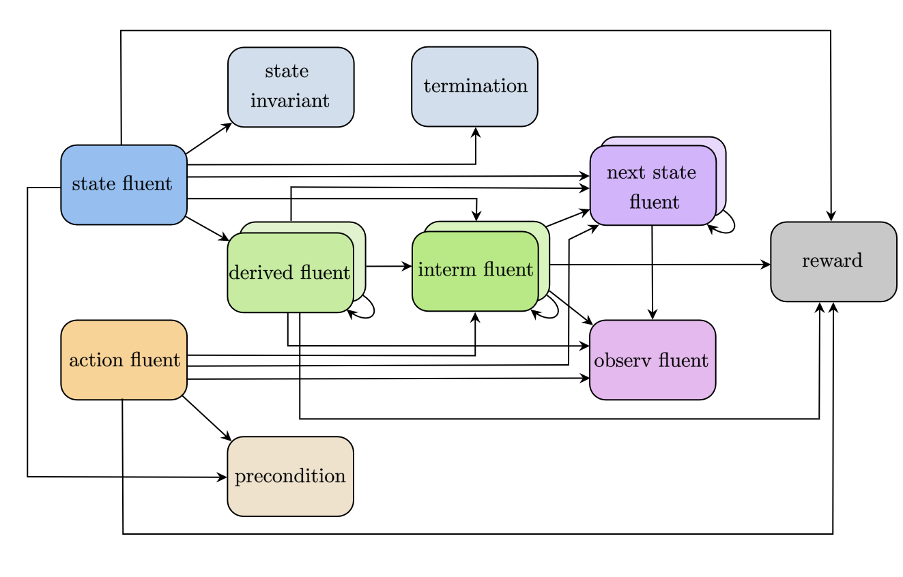

RDDL Language Description
===============

Introduction
-------------------

The Relational Dynamic Influence Diagram Language (RDDL) is a uniform language 
where states, actions, and observations (whether discrete or continuous) are 
parameterized variables and the evolution of a fully or partially observed 
(stochastic) process is specified via (stochastic) functions over next state 
variables conditioned on current state and action variables (n.b., concurrency 
is allowed). Parameterized variables are simply templates for ground variables 
that can be obtained when given a particular problem instance defining possible 
domain objects. 

Semantically, RDDL is simply a dynamic Bayes net (DBN) 
(with potentially many intermediate layers) extended with a simple influence 
diagram (ID) utility node representing immediate reward. An objective function 
specifies how these immediate rewards should be optimized over time for optimal 
control. For a ground instance, RDDL is just a factored MDP (or POMDP, if 
partially observed).

File Structure and Syntax
-------------------

Domain Block
^^^^^^^^^^^^^^^^^^^

The ``domain`` block defines the domain of a problem that will be used to perform 
simulations accordingly. The objects, states and actions to be simulated, and the 
rules that the simulations should follow, are all defined in this block. 
The block should be written in a .rddl file as the following:
 
.. code-block:: shell

    domain <domain_name> {
        requirements { <code> };
        types { <code> };
        pvariables { <code> };
        cpfs { <code> };
        reward = <code>;
        state-invariants { <code> }; // optional
        action-preconditions { <code> }; // optional
        termination { <code> }; // optional
    }
    
.. note::
   There should not be a semicolon at the end of the domain block.

Requirements
^^^^^^^^^^^^^^^^^^^

The ``requirements`` section of the domain block states the characteristics of the 
domain. Specifically, the requirements section tells the parser what kind of 
parameterized variables will be defined, what types of values (integer, real 
numbers or user defined values) the variables will be assigned to, and how the 
actions and reward will be determined.

The ``requirements`` section will be included in the .rddl file with the following format:

.. code-block:: shell

    requirements { <requirement1>, <requirement2>, ... };

There are currently nine requirements that can be implemented in RDDL, as shown 
in the following table:

.. list-table:: Possible Requirements
   :widths: 60 60
   :header-rows: 1

   * - requirement
     - representation
   * - concurrent
     - This domain permits multiple non-default actions
   * - constrained-state
     - This domain uses state constraints
   * - continuous
     - This domain uses real-valued parameterized variables
   * - cpf-deterministic
     - This domain uses deterministic conditional functions for transitions (it is important to note that RDDL can also be used to model deterministic domains)
   * - integer-valued
     - This domain uses integer variables
   * - intermediate-nodes
     - This domain uses intermediate parameterized variable nodes
   * - multivalued
     - This domain uses enumerated parameterized variables
   * - partially-observed
     - This domain uses observation parameterized variables so it is treated as a POMDP (not an MDP as is otherwise the case)
   * - reward-deterministic
     - This domain does not use a stochastic reward

Types
^^^^^^^^^^^^^^^^^^^

The ``types`` section defines the objects and user defined values, if any, that will 
be used in the domain, according to the following format:

.. code-block:: shell

    types {
        <object1> : object;
        <object2> : object;
        ...

        <enumerable> : {@<value1>, @<value2>, ... };
    };

An ``object`` is a user-defined parameter that will be used to parameterize variables. 
They are often things or people that will be simulated to move or act in this domain. 

For example, consider a simulation where elevators are to travel between different 
floors and open doors to allow people to get on and off the elevators to 
ultimately minimize the waiting time (see elevators.rddl example). ``person``
and ``elevator`` can be declared as objects in the domain as follows:

.. code-block:: shell

    types {
        person : object;
        elevator : object;
    };

The ``@`` quantifier specifies that the given value should be treated as an object rather than a pvariable.
This symbol is generally optional for objects in expressions, however:

.. warning::
   If the ``@`` symbol is not prepended to an object, and there is a variable defined in the domain 
   with the same name as the object that does not have parameters, then it is ambiguous whether the 
   object or the variable are being referred to inside an expression. 
   The compiler will raise an exception in this case.

Parameterized Variables (pVariables)
^^^^^^^^^^^^^^^^^^^

This section is included to declare all variables used in the domain. 
These variables include constant values, states and action variables, as well as 
potentially intermediate and observed variables. 
Ultimately, these variables will serve as condition-determining parameters in 
transitions of states. 
The variables declared in this section can be either parameterized by one or more 
objects, or non-parameterized, and they are declared according to the following 
format:

.. code-block:: shell

    pvariables {
    
        // parameterized variables
        <pvariable1>(<obj1>, [<obj2>, ...]) : { <type_fluent>, <type_value>, default = <value> };
        <pvariable2>(<obj1>, [<obj2>, ...]) : { <type_fluent>, <type_value>, default = <value> };
        ...
        
        // non-parameterized variables
        <variable1> : { <type_fluent>, <type_value>, default = <value> };
        <variable2> : { <type_fluent>, <type_value>, default = <value> };
        ...
    };

The ``<type_fluent>`` argument specifies the function of the variable declared. 
This argument can take one of the following five values:

* ``non-fluent``: variable that never changes during a simulation. Non-fluents will be initialized in the non-fluents block before simulation starts
* ``state-fluent``: or state variable, variable that represents the state of a simulation, often used to describe the state or relative state of objects (e.g., locations, occupancy, etc.).
* ``interm-fluent``: or intermediate variable, variable that is used as an intermediate conditional probability calculation. Intermediate fluents must have a level of stratification, and are strictly stratified so that an intermediate variable can only condition on intermediate variables of a strictly lower level or state variable.
* ``observ-fluent``: or observation variable, variable used as a conditional observation probability in partially observable Markov decision process (POMDP).
* ``action-fluent``: or action variable, variable that represents the action of a simulation, often used to describe if a transition between two different states is happening.

Fluent variables in RDDL have a strict dependency structure, as outlined in the schematic below:

 
In summary:
- non fluents can be used in any expression
- state invariants and termination block are checked in each state, so they are expressed using unprimed state variables
- action preconditions are checked for each state-action pair, so they are also expressed using unprimed state variables
- derived fluents are deprecated and should be replaced by interm fluents
- next state and interm fluents are allowed to depend on other next state and interm fluents by default, unless `allow_synchronous_state = False`
- cyclic dependencies (e.g. a fluent expression depends on the value of that fluent) are not allowed.

The ``<type_value>`` argument specifies the values the declared variable can take on. 
This argument can be one of the following four options:

* ``bool``: boolean valued variable (i.e., true, false). Note that these variables are evaluated to 1 or 0 when used in arithmetic expressions
* ``int``: integer valued variable (i.e., 1, 2, 3, 10, 100 ...)
* ``real``: real valued variable (i.e., 0.1, 0.25, 1.414, 2.718, 3.142 ...)
* ``<enumerable>``: an enumerated value defined by the user in the ``types`` section
* ``<object>``: an object type defined in the ``types`` section whose objects are specified in the instance (this is a new feature of pyRDDLGym)

The last argument sets a default value to the declared variable. 
If the variable is a non-fluent or state-fluent and is not specified to have a 
certain value in the ``non-fluent`` or ``instance`` block (which will be 
mentioned in later sections), the variable will take its default value. 
If the variable is an action-fluent, then when the action is not performed 
this variable will take on its default value; an action-fluent taking an non-default 
value would imply the action is performed in most cases. 
Default values are not specified for interm-fluent and observ-fluent.

.. note::
   In case of a interm-fluent, the old RDDL specification required that the last 
   argument be ``level = <int>`` instead, where the integer represents the level of stratification. 
   However, the new RDDL specification no longer requires levels to be specified in the domain, since they are 
   computed automatically at compile time.

Conditional Probability Functions (CPFs)
^^^^^^^^^^^^^^^^^^^

The ``cpfs`` section is the key to describe how the simulation will change the states 
at each time step: this section contains all state transition functions. 
The functions describe how each state-fluent at the next time step will vary based
on the fluents of the current time step. 
If this is a stochastic domain, then the ``cpfs`` block represents the state-fluents 
at the next time step with some probability distribution function. 

Each state-fluent requires a conditional probability function to represent the 
value of this state-fluent at the next time step. 
The state-fluent at the next time step is represented by adding an apostrophe 
at the end of the state-fluent (i.e., ``<name_state-fluent>'``). 
If the state-fluent is parameterized by ``objects``, the objects are referenced 
by a ``?`` followed with user assigned names for the query objects. 

For example, if a pvariable ``elevator-at-floor(elevator, floor)`` is defined, 
then ``elevator-at-floor(?e, ?f)`` represents the value of this variable 
parameterized by elevator ``?e`` and floor ``?f``.

.. code-block:: shell

    cpfs {
        <cpf1>(<param1>, <param2>, ...) = <expression1>;
        <cpf2>(<param1>, <param2>, ...) = <expression2>;
        ...
    };

The function can be constructed using various conditional expressions, logical 
and arithmetic operators, as well as probability distribution expressions. 
For example, the following code comes from the elevator control example:

.. code-block:: shell

    person-waiting-up'(?f) = 
        if (person-waiting-up(?f) ^ 
            ~exists_{?e: elevator} [elevator-at-floor(?e, ?f) ^ elevator-dir-up(?e) ^ ~elevator-closed(?e)])
        then true 
            else Bernoulli(ARRIVE-PARAM(?f));

where ``?f`` is a ``floor`` object and ``?e`` is an ``elevator`` object. 
This function assigns a value true to the next-time-step ``person-waiting-up``
state-fluent if there is already a person waiting and no elevator has arrived to 
load the person; otherwise there is a Bernoulli probability distribution with 
``ARRIVE-PARAM(?f)`` chance of a person arriving at the floor and setting the 
next-time-step ``person-waiting`` up state-fluent to be true. 
Evidently, this models the randomness of people arriving and waiting for an elevator.

.. warning::
   Cyclic dependencies between two or more CPFs, 
   or a CPF expression that refers to itself, 
   is strictly prohibited and will raise an exception.
   
The usage of all conditional expressions, logical and arithmetic operators, and 
probability distribution expressions will be described in a later section.

Reward
^^^^^^^^^^^^^^^^^^^

To properly know which action should be performed, an objective function is needed. 
This objective function is represented in the ``domain`` block as the ``reward``. 
The reward function should be designed such that the actions are taken to maximize 
the reward. 
This is done by assigning a value to reward using state-fluents, interm-fluents, 
or action-fluents with the following format:

.. code-block:: shell

    reward = <expression>;

where all conditions must remain true with respect to all actions taken during the simulation.

Action-Preconditions and State-Invariants
^^^^^^^^^^^^^^^^^^^

The ``action-preconditions`` block is used for specifying constraints that 
restrict single or joint action usage in a particular state and is only checked 
when an action is executed:

.. code-block:: shell

    action-preconditions {
        <condition1>;
        <condition2>;
        ...
    };

The ``state-invariants`` block is used for constraints that do not include any 
action-fluents and thus represent state property assertions that should never be violated. 
These constraints are checked in the initial state and every time a next state is reached.
The simulator should exit if a state-invariant is violated and hence the author 
should specify state-invariants as a way to verify expected domain properties.

.. code-block:: shell

    state-invariants {
        <condition1>;
        <condition2>;
        ...
    };

Termination
^^^^^^^^^^^^^^^^^^^

An Addition made to the RDDL language during the development of this infrastructure 
is the ``termination`` block.
This block is intended to specify terminal states in the MDP, 
which when reached the simulation will end.
A terminal state is a valid state of the MDP (to emphasize the difference from 
``state-invariants``).
An example of terminal state can be any state within the goal set for which the 
simulation should not continue, or a state where there are no possible actions
and the simulation should end.
E.g., hitting a wall when it is not allowed. When a terminal state is reached 
the state is returned from the environment and the ``done`` flag is returned as True.
The reward is handled independently by the reward function, thus if there is a 
specific reward for the terminal state, it should specified in the reward formula.
The termination block has the following syntax:

.. code-block:: shell

    termination {
        <terminal_condition1>;
        <terminal_condition2>;
        ...
    };

where ``<terminal_condition#>`` are boolean formulas.
The termination decision is a disjunction of all the conditions in the block 
(termination if at least one is True).

Non-fluents Block
^^^^^^^^^^^^^^^^^^^

The ``non-fluents`` block defines all objects need and all non-fluent variable 
values in a problem domain which is specified in the same block. 
The non-fluents block should have the following syntax:
 
.. code-block:: shell

    non-fluents <non-fluents_name> {
        domain = <domain_name>;
        objects {
            <object_name1> : {<obj1>, <obj2>, ... };
            <object_name2> : {<obj1>, <obj2>, ... };
            ...
        };

        non-fluents {
            <non-fluent1> = <value1>;
            <non-fluent2> = <value2>;
            ...
        };
    }

.. note::
   There should not be a semicolon at the end of the ``non-fluents`` block.

The ``objects`` section define all objects needed; these are grouped by types 
and listed in curly bracket. 
The ``non-fluents`` section lists all non-fluent variables that do not take 
their default values and assigns a value to them. 
If the ``non-fluent`` variable is parameterized by objects, simply state the 
parameters in parentheses after the non-fluent, e.g.:

.. code-block:: shell

    <non-fluent>(<obj1>, <obj2>, ...) = <value>;

``non-fluent`` variables in the domain that are not listed in this section will 
take their default value stated in the ``domain`` block.
For simplicity, assigning true to a bool type variable can be achieved by stating 
the name of the variable; similarly, assigning false to a bool type variable can 
be achieved by stating the name of the variable with an apostrophe after it, i.e.:

.. code-block:: shell

    bool_variable1; // same as bool_variable1 = true;
    bool_variable2'; // same as bool_variable2 = false;

Instance Block
^^^^^^^^^^^^^^^^^^^

The ``instance`` block defines a specific problem instance to be simulated, 
by stating the initial states, number of actions that can occur at a single time 
step (concurrently), as well as the horizon and the discount factor for MDP. 
It is also specified in this block which ``domain`` and ``non-fluents`` block this instance 
is referring to. 
The ``instance`` block should have the following syntax:

.. code-block:: shell

    instance <instance_name> {
        domain = <domain_name>;
        non-fluents = <non-fluents_name>;
        init-state {
            <state-fluent1> = <value1>;
            <state-fluent2> = <value2>;
            ...
        };
        max-nondef-actions = <int>;
        horizon = <int>;
        discount = <real>;
    }

.. note::
   There should not be a semicolon at the end of the ``instance`` block.

Any state-fluents that do not take their default value initially should be assigned 
a value in the ``init-state`` section. 
Similarly as in the ``non-fluent`` block, bool type variables can simply be assigned 
true by calling its name, and assigned false by adding an apostrophe. 
State-fluent variables in the domain that are not listed in this section 
will take their default value stated in the ``domain`` block.

The ``max-nondef-actions`` represents the maximum number of action-fluent there 
can be at a single time step that are not at their default values, or the maximum 
number of concurrent actions. Setting this parameter
to ``pos-inf`` will set the number of concurrent actions equal to the total number
of action-fluents.

The ``horizon`` and ``discount`` factor are parameters for MDP to work on this instance. 
``horizon`` is the total number of time steps that the instance will be simulated 
for (e.g., if horizon = 10, the instance will be simulated from time = 0 to time = 9). 

The ``discount`` represents how much more/less future rewards should be worth 
compared to the current reward. 
For example, if discount = 0.9, then 1 point of reward in two time steps after 
would have the same value as 1 * 0.9 * 0.9 = 0.81 point of reward currently. 

.. note::
   A discount factor of less than 1 means earlier rewards are preferred, a 
   discount factor of greater than 1 means later rewards are preferred, and a discount 
   factor of 1 means the reward should have no difference with respect to time.

Functions and Expressions
-------------------

As of the time of this writing, RDDL syntax supports the following mathematical
operations:

.. list-table:: Basic Math Functions
   :widths: 50 60
   :header-rows: 1

   * - RDDL syntax
     - description
   * - ``div[x, y]``
     - divides ``y`` by ``x``; arguments must be integer
   * - ``mod[x, y]``
     - returns ``x % y``; arguments must be integer
   * - ``min[x, y]``, ``max[x, y]``
     - the minimum and maximum, respectively, of ``x`` and ``y``
   * - ``abs[x]``
     - the absolute value of ``x``
   * - ``sgn[x]``
     - returns the sign of ``x``, e.g. ``1 if x > 0; -1 if x < 0; 0 if x == 0``
   * - ``round[x]``
     - rounds ``x`` to the nearest integer
   * - ``floor[x]``
     - the greatest integer less than ``x``
   * - ``ceil[x]``
     - the smallest integer greater than ``x``

the following exponential and logarithmic functions:

.. list-table:: Exponential and Logarithmic Functions
   :widths: 50 60
   :header-rows: 1
   
   * - RDDL syntax
     - description
   * - ``log[x, b]``
     - the logarithm of ``x`` with base ``b``
   * - ``ln[x]``
     - the natural logarithm of ``x``
   * - ``exp[x]``
     - the value ``e ^ x`` where ``e`` is Euler's constant
   * - ``pow[b, x]``
     - the value of ``b ^ x``
   * - ``sqrt[x]``
     - the square root of ``x``

and the following trigonometric functions:

.. list-table:: Trigonometric Functions
   :widths: 60 60
   :header-rows: 1
   
   * - RDDL syntax
     - description
   * - ``cos[theta]``, ``sin[theta]``, ``tan[theta]``
     - the cosine, sine and tangent, respectively, of ``theta``
   * - ``acos[theta]``, ``asin[theta]``, ``atan[theta]``
     - the arc cosine, sine and tangent, respectively, of ``theta``
   * - ``cosh[theta]``, ``sinh[theta]``, ``tanh[theta]``
     - the hyperbolic cosine, sine and tangent, respectively, of ``theta``

The new language specification also adds the following functions:

.. list-table:: New Functions
   :widths: 60 60
   :header-rows: 1
   
   * - RDDL syntax
     - description
   * - ``gamma[x]``, ``lngamma[theta]``
     - the gamma function, and the natural log of the gamma function, respectively, evaluated at ``x``
   * - ``hypot[x, y]``
     - the value of ``sqrt[pow[x, 2] + pow[y, 2]]``
     
Conditional Expressions
-------------------

Conditional expressions are necessary to give conditional dependencies to the 
state-action graphical model. These expressions are almost always necessary when 
writing conditional probability functions. Currently, RDDL support two types of 
conditional expressions: ``if-else`` and ``switch``.

Equality and Inequality Comparison Expressions
^^^^^^^^^^^^^^^^^^^

RDDL supports basic comparison expressions including equality (==), 
disequality (~=), and inequality comparisons (>, <, >=, <=). Equality (==) 
and disequality (~=) can be used between any identical range variables, while 
inequality comparisons (>, <, >=, <=) can be used between any numerically valued 
variables (real, int, and bool).

.. warning::
   Using any of the comparison operators on objects of different types, 
   or mixed object and primitive (e.g. real, int, bool) data types, will raise an 
   exception; this includes equality and disequality operators.
    
If-then-else
^^^^^^^^^^^^^^^^^^^

The ``if-then-else`` expressions is similar to any if expressions in other programing languages:
 
.. code-block:: shell

    if (<condition>) then <expression1> else <expression2>

If ``<condition>`` evaluates to true, ``<expression1>`` will be used; otherwise, ``<expression2>`` will be used. 
 
Each ``<expression>`` can also be an ``if-then-else`` expression, as shown 
in the following. Also note that in RDDL, parentheses ( ) and square brackets [ ] 
serve the same purpose of grouping and are interchangeable.

.. code-block:: shell

    if (<conditions1>) then [if (<conditions2>) then <expression2> else <expression1>] else <expression2>;
    if (<conditions1>) then <expression1> else if (<conditions2>) then <expression2> else <expression2>;

switch
^^^^^^^^^^^^^^^^^^^

The ``switch`` expression can be used if the argument involved in the desired 
conditions is an enumerated variable. The syntax of this expressions is

.. code-block:: shell

    switch (<argument>) {
        case @<value1> : <expression1>,
        case @<value2> : <expression2>,
        ...
        default : <default expression>;  // optional
    };
 
This allows RDDL to examine the value of ``<argument>`` first, then use the 
corresponding expression associated with that value.

.. note::
   Note that the default statement must be included if the cases are not exhaustive. 

.. warning::
   Multiple cases with the same case value, multiple default statements, 
   or non-exhaustive cases without a default statement, will raise an exception.

Logical Expressions
-------------------

RDDL supports the logical expressions AND (^), OR (|), NOT (~), IMPLIES (=>), and 
EQUIVALENCE (<=>) for boolean (binary) variables.

Additionally, RDDL supports the "for all" and "there exists" expressions.
The following expression returns true if for all possible (tuples of) objects, 
``<condition>`` evaluates to true. If there exists any possible (tuple of) objects 
that would cause ``<condition>`` to be false, the expression will return false:

.. code-block:: shell

    forall_{?<obj1>: <object1_name>, [?<obj2>: <object2_name>, ...]} [<condition>]

The following expression returns true if there exists any possible (tuple of) 
objects that would cause ``<condition>`` to be true. If for all possible (tuples of) 
objects, ``<condition>`` evaluates to false, the expression will return false:

.. code-block:: shell

    exists_{?<obj1>: <object1_name>, [?<obj2>: <object2_name>, ...]} [<condition>]

Arithmetic Operators and Aggregations
-------------------

RDDL supports basic binary arithmetic operations using typical symbols: 
ADD(+), SUBTRACT(-), MULTIPLY(*), and DIVIDE(/).

Arithmetic operations, or "aggregations", over a sequence of arguments
such as sum and product are also supported:

.. code-block:: shell

    sum_{?<obj1>: <object1_name>, [?<obj2>: <object2_name>, ...]} [<expression>]
    prod_{?<obj1>: <object1_name>, [?<obj2>: <object2_name>, ...]} [<expression>]

.. note::
   Unlike the old RDDL specification, it is now possible to aggregate over 
   enumerated (domain object) types in addition to instance-defined objects.

RDDL supports the following aggregations over types:

.. list-table:: Aggregations
   :widths: 60 60
   :header-rows: 1
   
   * - RDDL syntax
     - description
   * - ``sum_{...} [<expression>]``
     - the sum of ``<expression>``
   * - ``prod_{...} [<expression>]``
     - the product of ``<expression>``
   * - ``avg_{...} [<expression>]``
     - the arithmetic average of ``<expression>``
   * - ``minimum_{...} [<expression>]``
     - the minimum of ``<expression>``
   * - ``maximum_{...} [<expression>]``
     - the maximum of ``<expression>``

The new language extension now also supports ``argmin`` and ``argmin`` with the following
syntax:

.. code-block:: shell

    argmin_{?<obj>: <object_name>} [<expression>]
    argmax_{?<obj>: <object_name>} [<expression>]

The first (second) expression returns the index of the object ``<obj>`` that minimizes 
(maximizes) ``<expression>`` over all objects in ``<object_name>``. 

.. note::
   Unlike aggregations, ``argmax`` and ``argmin`` iterate over a single parameter only.

.. warning::
   It is required to put a pair of parentheses ``(...)`` or ``[...]`` 
   around each aggregation, to make sure the correct arithmetic order of operations 
   is been parsed by RDDL. Failure to do this could result in the parser silently
   compiling expressions that differ from their RDDL specification.

Probability Distributions
-------------------

CPFs assign value to next state variables using probability distributions. 
These probability distributions are expressed using keywords with parameters, 
where all parameters can be expressions.

Discrete Distributions
^^^^^^^^^^^^^^^^^^^

RDDL currently supports the following discrete (int, bool or enumerated values) probability distributions:

.. list-table:: Discrete Probability Distributions
   :widths: 100 60 60
   :header-rows: 1
   
   * - RDDL syntax
     - description
     - reparameterizable
   * - ``KronDelta(v)``
     - Places all probability mass on its discrete argument ``v``
     - Yes
   * - ``Bernoulli(p)``
     - Samples a boolean value with probability of true given by parameter ``p``; must have ``0 <= p <= 1``
     - Yes
   * - ``Discrete(<var_name>, p)``
     - Samples an enumerated value with probability vector ``p``; elements of ``p`` must be non-negative and sum to 1
   	 - Yes
   * - ``UnnormDiscrete(<var_name>, p)``
     - Same as ``Discrete``, except ``p`` needs to be only non-negative   
     - Yes
   * - ``Poisson(rate)``
     - Samples an integer value from a Poisson distribution with given rate parameter   
     - No
   * - ``Binomial(trials, p)``
     - Samples an integer value from a Binomial distribution with given number of trials and trial probability of success ``p``
     - No
   * - ``NegativeBinomial(successes, p)``
     - Samples an integer value from a Negative Binomial distribution with required number of successes and trial probability of success ``p``
     - No
   * - ``Geometric(p)``
     - Samples an integer value from a Geometric distribution with trial probability of success ``p``
     - Yes

In a ``Discrete`` probability distribution, the probability vector assign a 
probability density to each possible value of the enumerated variable, 
with the following format:

.. code-block:: shell

    Discrete(<variable_name>,
        @<value1> : <expression1>,
        @<value2> : <expression2>,
        ...
    )
    
The new RDDL also supports a more compact syntax for ``Discrete`` and ``UnnormDiscrete``,
which is similar to aggregation:

.. code-block:: shell

    Discrete_{?<value> : <variable_name>}( <expression>(?<value>) )
    UnnormDiscrete_{?<value> : <variable_name>}( <expression>(?<value>) )

where ``<expression>`` must be a real-valued expression or pVariable.

Continuous Distributions
^^^^^^^^^^^^^^^^^^^

RDDL also currently supports the following continuous (real values) probability distributions:

.. list-table:: Continuous Probability Distributions
   :widths: 100 60 60
   :header-rows: 1
   
   * - RDDL syntax
     - description
     - reparameterizable
   * - ``DiracDelta(v)``
     - Places all probability mass on its continuous argument ``v``
     - Yes
   * - ``Normal(mean, variance)``
     - Samples a continuous value from a Normal distribution with given mean and variance
     - Yes
   * - ``Uniform(lower, upper)``
     - Samples a real value from a Uniform distribution with given lower and upper bounds
     - Yes
   * - ``Exponential(scale)``
     - Samples a real value from an Exponential distribution with mean ``scale``
     - Yes
   * - ``Weibull(shape, scale)``
     - Samples a real value from a Weibull distribution with given shape and scale parameters
     - Yes
   * - ``Gamma(shape, scale)``
     - Samples a real value from a Gamma distribution with given shape and scale parameters
     - ``scale`` only
   * - ``Beta(a, b)``
     - Samples a real value from a Beta distribution with parameters ``a`` and ``b``
     - No
   * - ``Pareto(shape, scale)``
     - Samples a real value from a Pareto distribution with given shape and scale parameters
     - Yes
   * - ``Student(df)``
     - Samples a real value from a Student-t distribution with zero mean, unit scale and degrees of freedom ``df``
     - No
   * - ``Gumbel(mean, scale)``
     - Samples a real value from a Gumbel distribution with given mean and scale parameters
     - Yes
   * - ``Laplace(mean, scale)``
     - Samples a real value from a Laplace distribution with given mean and scale parameters
     - Yes
   * - ``Cauchy(mean, scale)``
     - Samples a real value from a Cauchy distribution with given mean and scale parameters
     - Yes
   * - ``Gompertz(shape, scale)``
     - Samples a real value from a Gompertz distribution with given shape and scale parameters
     - Yes
   * - ``ChiSquare(df)``
     - Samples a real value from a Chi-Square distribution with degrees of freedom ``df``
     - No
   * - ``Kumaraswamy(a, b)``
     - Samples a real value from a Kumaraswamy distribution with parameters ``a`` and ``b``; this is a reparameterizable analogue of the Beta distribution
     - Yes

New Language Features
-------------------

Nested pVariables
^^^^^^^^^^^^^^^^^^^

Another new language feature of RDDL is the ability to nest pVariable calculations. This offers
much greater expressiveness of the RDDL language and allows much more complex reasoning
to be carried out using enumerated values. The following is valid syntax

.. code-block:: shell

    <pvar_1>(..., <pvar_2>(?<value_1>, ?<value_2>, ...), 
             <pvar_3>(?<value_1>, ?<value_2>, ...), ..., ?<value1>, ?<value_2>, ...)

provided the types of ``?<value_#>`` match the definition of ``?<pvar_#>`` in the ``pvariables`` block.

Nesting can also be performed to arbitrary depth, i.e.

.. code-block:: shell

    <pvar_1>(<pvar_2>(... <pvar_n>(<?value_1>, ...) ...))
    
provided the types of the variables are correct.

Finally, it is possible to use a combination of enumerated values, objects and other pVariables as parameters
when evaluating a pVariable

.. code-block:: shell

    <pvar>(<pvar_as_parameter>([?<object1>, ...]), @<enum_value>, ?<object>)
    
as long as ``@<enum_value>``, ``?<object>`` and ``<pvar_as_parameter>`` types match
what is required by the outer ``<pvar>``.

Multivariable Distributions
^^^^^^^^^^^^^^^^^^^

The new RDDL syntax now supports sampling from some well-known multivariable probability distributions.
For example, a Dirichlet distribution with parameter vector "alpha"
can be parameterized by a pVariable ``alpha`` that takes at least one enumerated value. 
The syntax to sample from this distribution and assign it to a CPF is

.. code-block:: shell

    <cpf>(?<value>) = Dirichlet[?<value>]( alpha(_) );

where ``cpf`` is the name of a CPF (e.g., state-fluent, interm-fluent), 
``_`` indicates the argument of ``alpha`` that describes where the parameter vector
of the Dirichlet distribution is described, and ``[?<value>]`` indicates which 
parameter of ``<cpf>`` is to receive the sample from this distribution.

.. warning::
   Unlike the single-variable distributions, samples from 
   multivariable distributions must be assigned to CPFs directly 
   (e.g. cannot be nested inside other expressions). 
   Furthermore, their parameters cannot be compound expressions either, 
   but can refer to any valid CPF.

It is also possible to include an arbitrary number of other parameters from the 
``<cpf>`` in "alpha", e.g. the following could be valid syntax:

.. code-block:: shell

    <cpf>(?<value1>, ?<value2>) = Dirichlet[?<value1>]( alpha(?<value2>, _) );
	<cpf>(?<value1>, ?<value2>) = Dirichlet[?<value1>]( alpha(_, ?<value2>) );
	
provided the types of the required and given arguments in ``alpha`` match. These
examples could be seen as "batched" sampling, where the parameter ``?<value2>`` 
not corresponding to the sampled dimension specifies a single sample in the "batch".

In a similar way, new RDDL also provides a syntax for the Multinomial distribution
with given trials ``trials`` and probabilities ``p``

.. code-block:: shell

    <cpf>(?<value>) = Multinomial[?<value>]( trials, p(_) );

the multivariate normal with mean ``mean`` and covariance ``cov``

.. code-block:: shell

    <cpf>(?<value>) = MultivariateNormal[?<value>]( mean(_), cov(_, _) );

and the multivariate Student-t with mean ``mean``, Sigma matrix ``sigma`` and
degrees of freedom ``df``

.. code-block:: shell

    <cpf>(?<value>) = MultivariateStudent[?<value>]( mean(_), sigma(_, _), df );

Matrix Operations on pVariables
^^^^^^^^^^^^^^^^^^^

The new RDDL language allows for matrix linear algebra to be performed over pVariables,
as if they were matrices. For example, the determinant of the matrix described by 
an expression ``<expression>`` parameterized by (at least) two values can be written as

.. code-block:: shell

    det_{?<value1> : <variable_name1>, ?<value2> : <variable_name2>} <expression>( ?<value1>, ?<value2> )
    
which can be viewed roughly as an aggregation over two variables, corresponding to row and column.
As with vectorized sampling, it is also possible to incorporate variables from 
the outer scope to serve as "batch" dimensions, i.e.

.. code-block:: shell

    det_{?<value1> : <variable_name1>, ?<value2> : <variable_name2>} <expression>( ?<value1>, ?<value2>, ?<value3>, ... )

The syntax for computing the matrix inverse and pseudo-inverse of ``<expression>`` is

.. code-block:: shell

    inverse[ row=?<value1>, col=?<value2> ] <expression>( ?<value1>, ?<value2> )
    pinverse[ row=?<value1>, col=?<value2> ] <expression>( ?<value1>, ?<value2> )

Similar to vectorized sampling, these operations produce a matrix rather than a scalar,
so ``?<value1>`` and ``?<value2>`` must be variables defined in the outer scope 
into which the inverse matrix will be assigned. Also, to break ambiguity between
which of ``?<value1>`` and ``?<value2>`` corresponds to the row and column dimensions
of ``<expression>``, they must be explicitly assigned to the row and column dimensions as
in the code above, i.e. ``?<value1>`` runs over the rows and 
``?<value2>`` runs over the columns of the "matrix" produced by ``<expression>``. 
As with determinant, this calculation can be "batched" if ``<expression>`` is 
appropriately parameterized by other variables from the outer scope.
