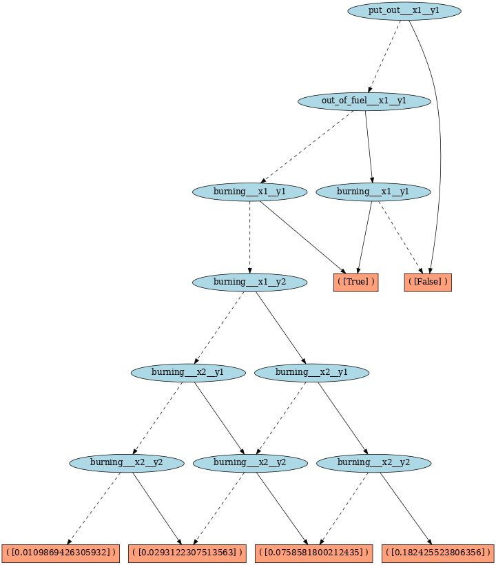
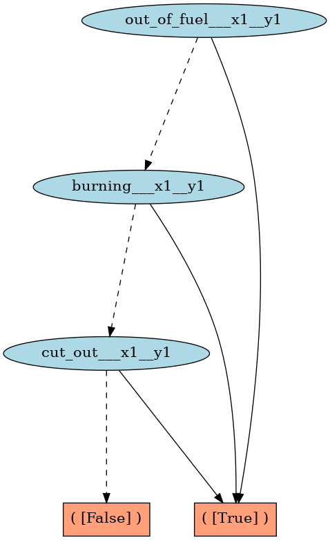
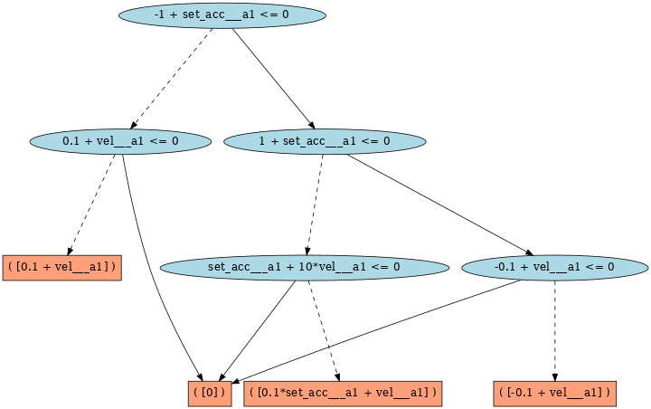
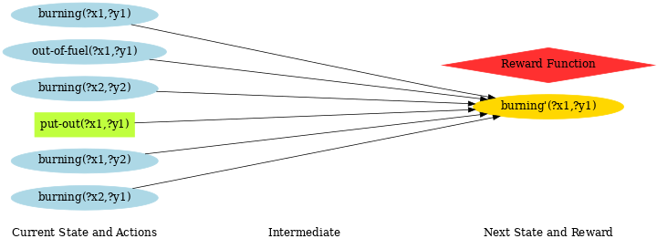
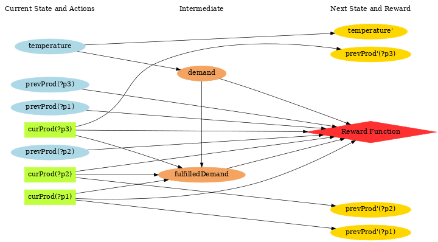

Symbolic Toolset for pyRDDLGym
##############################

In this part, we provide explanations on the symbolic toolkits that you can use with `pyRDDLGym <https://github.com/pyrddlgym-project/pyRDDLGym>`_. 
Specifically, we provide the following:

- :ref:`Symbolic compilation of CPFs <xadd-compilation-of-cpfs>` (conditional probability functions) in XADD (eXtended Algebraic Decision Diagram)

- :ref:`Dynamic Bayes Net (DBN) visualization <dbn-visualization>`, allowing dependence analysis

- Symbolic Dynamic Programming (SDP):

  - :ref:`value-iteration`
  - :ref:`policy-evaluation`

These functionalities are available through the `pyRDDLGym-symbolic <https://github.com/pyrddlgym-project/pyRDDLGym-symbolic>`_ package.

Installation
************

.. code-block:: bash

    # Create and activate a new conda environment
    conda create -n symbolic python     # Note: Python 3.12 won't work with Gurobi 10.
    conda activate symbolic

    # Install the xaddpy >= 0.2.5
    pip install xaddpy

    # Manually install pyRDDLGym >= 2.0.1
    cd ~/path/to/pyRDDLGym
    git checkout pyRDDLGym-v2-branch
    pip install -e .

    # (Optional) manually install rddlrepository-v2
    # First, make sure you git cloned rddlrepository
    # https://github.com/pyrddlgym-project/rddlrepository
    cd ~/path/to/rddlrepository
    git checkout v2-branch
    pip install -e .

    # Install Gurobipy (make sure you have a license)
    python -m pip install gurobipy

    # Finally, install pyRDDLGym_symbolic
    cd ~/path/to/pyRDDLGym_symbolic
    pip install -e .

Installing pygraphviz
=====================

Step 1: Installing graphviz
---------------------------

1. For Ubuntu/Debian users, run the following command.

.. code-block:: bash

    sudo apt-get install graphviz graphviz-dev

2. For Fedora and Red Hat systems, you can do as follows.

.. code-block:: bash

    sudo dnf install graphviz graphviz-devel

3. For Mac users, you can use `brew` to install `graphviz`.

.. code-block:: bash

    brew install graphviz

Unfortunately, we do not provide support for Windows systems, though you can refer to the `pygraphviz documentation <https://pygraphviz.github.io/documentation/stable/install.html>`_ for information.

Step 2: Installing pygraphviz
-----------------------------

1. Linux systems

.. code-block:: bash

    pip install pygraphviz

2. MacOS

.. code-block:: bash

    python -m pip install \
        --global-option=build_ext \
        --global-option="-I$(brew --prefix graphviz)/include/" \
        --global-option="-L$(brew --prefix graphviz)/lib/" \
        pygraphviz

Note that due to the default installation location by `brew`, you need to provide some additional options for `pip` installation.

.. _xadd-compilation-of-cpfs:

XADD Compilation of CPFs
************************

XADD (eXtended Algebraic Decision Diagram) [Sanner at al., 2011] enables compact representation and operations with symbolic variables and functions. In fact, this data structure can be used to represent CPFs defined in a RDDL domain once it is grounded for a specific RDDL instance.

We use the `xaddpy <https://github.com/jihwan-jeong/xaddpy>`_ package that provides a Python implementation of XADD (originally implemented in Java). To install the package, simply run the following:

.. code-block:: bash

    pip install xaddpy

XADD compilation of the Wildfire domain
=======================================

In this article, we are going to walk you through how you can use `xaddpy` to compile a CPF of a grounded fluent into an XADD node. 

For example, let's look at the `Wildfire <https://ataitler.github.io/IPPC2023/wildfire.html>`_ instance of 3 x 3 locations.

.. image:: ../Images/wildfire.gif
    :align: center

Once the CPFs are grounded for this instance, we can see that the values of the non-fluents will simplify the CPFs. For instance, the neighboring cells of the `(x1, y1)` location are `(x1, y2)`, `(x2, y1)`, and `(x2, y2)`; hence, `burning'(x1, y1)` should only depend on the states of these neighbors --- plus `(x1, y1)` itself --- but none others. 

Once you compile the CPFs of this instance into an XADD, you can actually see this structure easily. In other words, XADD compilation reveals the DBN dependency structures of different variables, which we also explain below.

To run the XADD compilation, we first need to import the domain and instance files. Then, we instantiate the `RDDLModelXADD` class with the grounded CPFs given by the `RDDLGrounder` object. The `RDDLModelXADD` has the method called `compile` which will compile the pyRDDLGym `Expression` objects to `XADD` nodes.

You can find an example run script from `pyRDDLGym_symbolic/examples/run_xadd_compilation.py <https://github.com/pyrddlgym-project/pyRDDLGym-symbolic/blob/main/pyRDDLGym_symbolic/examples/run_xadd_compilation.py>`_.

A nice way to interpret the resulting XADD may be to visualize it as a graph.
You can do this by calling the `save_graph` method of the `XADD` object.

.. code-block:: python

    # This is the object that has compiled XADD nodes
    xadd_model = RDDLModelXADD(...)

    # RDDLModelXADD.context is the XADD context object that 
    # handles all operations and stores all the nodes
    xadd_model.context.save_graph(
        xadd_model.cpfs["burning___x1__y1'"],
        file_name="Wildfire/burning___x1__y1"
    )

Here's the `result <https://github.com/pyrddlgym-project/pyRDDLGym-symbolic/blob/main/assets/burning___x1__y1.pdf>`_:

If the figure is too small to comprehend, you can click the link above to check out the XADD graph. Notice that the leaf nodes contain either a Boolean value or a real value. This is the case when you pass `reparam=False` to the `RDDLModelXADD` class constructor. Otherwise, you'll see the Bernoulli variables in the CPFs reparameterized using uniform random variables. When we don't reparameterize, the leaf nodes show the Bernoulli probability values.

How will the graph look like for `out-of-fuel'(x1, y1)` variable? Here's the result of `context.save_graph(model_xadd.cpfs["out-of-fuel_x1_y1'"], file_name="out_of_fuel_x1_y1")`:

Very neat!

XADD compilation of a domain with mixed continuous / discrete variables
=======================================================================

Although the Wildfire example nicely shows how XADD can be used to represent the CPFs of the domain, it only contains Boolean variables. In this part, we will show another example domain that has continuous fluents.

The domain we want to look at is the `UAV mixed <https://ataitler.github.io/IPPC2023/uav.html>`_ domain, whose definition is provided `here <https://github.com/pyrddlgym-project/pyRDDLGym-symbolic/blob/main/pyRDDLGym_symbolic/examples/files/UAV/Mixed/domain.rddl>`_.

If we follow the same procedure described above for the Wildfire domain with the domain name being replaced by `'UAV/Mixed'`, then we can compile the domain/instance in XADD. The overall DBN (dynamic Bayes net) structure of this instance is shown below.

Specifically, let's print out the CPF of `vel'(?a1)`, which is 

.. code-block:: none

    ( [-1 + set_acc___a1 <= 0]
            ( [1 + set_acc___a1 <= 0]
                    ( [-0.1 + vel___a1 <= 0]
                            ( [0] )
                            ( [-0.1 + vel___a1] )
                    )  
                    ( [set_acc___a1 + 10*vel___a1 <= 0]
                            ( [0] )
                            ( [0.1*set_acc___a1 + vel___a1] )
                    )  
            )  
            ( [0.1 + vel___a1 <= 0]
                    ( [0] )
                    ( [0.1 + vel___a1] )
            )  
    ) 

When visualized with `pygraphviz`, we get the following:

In this case, you can see that the decision nodes have linear inequality expressions instead of a Boolean decision. As for the function values at the leaf nodes, they are also linear expressions. `xaddpy` package can also handle arbitrary nonlinear decisions and function values using SymEngine/SymPy under the hood. 

Now, you can go ahead and use this functionality to analyze a given RDDL instance!

.. _dbn-visualization:

Visualizing DBNs with XADD
**************************

Next, we can now go ahead and draw DBN diagrams of various RDDL domain/instances. As a running example, we show how you can visualize a `Wildfire <https://ataitler.github.io/IPPC2023/wildfire.html>`_ instance as defined in `pyRDDLGym_symbolic/examples/files/Wildfire <https://github.com/pyrddlgym-project/pyRDDLGym-symbolic/blob/main/pyRDDLGym_symbolic/examples/files/Wildfire/domain.rddl>`_.

If you want to run an example code and follow the steps for better understanding, please take a look at the `run_dbn_visualization.py <https://github.com/pyrddlgym-project/pyRDDLGym-symbolic/blob/main/pyRDDLGym_symbolic/examples/run_dbn_visualization.py>`_ file.

Instantiate RDDL2Graph object
=============================

Firstly, you can instantiate a `RDDL2Graph` object by specifying the domain, instance, and some other parameters.

.. code-block:: python

    from pyRDDLGym_symbolic.core.visualizer import RDDL2Graph

    domain = 'Wildfire'
    domain_file = f'pyRDDLGym_symbolic/examples/files/{domain}/domain.rddl'
    instance_file = f'pyRDDLGym_symbolic/examples/files/{domain}/instance0.rddl'

    r2g = RDDL2Graph(
        domain=domain,
        domain_file=domain_file,
        instance_file=instance_file,
        directed=True,
        strict_grouping=True,
    )

Then, you can visualize the corresponding DBN by calling 

.. code-block:: python

    r2g.save_dbn(file_name='Wildfire')

which will save a file named `Wildfire_inst_0.pdf` to `./tmp/Wildfire`. Additionally, you can check the `Wildfire_inst_0.txt` file which records grounded fluent names and their parents in the DBN. 

The output of the function call looks like `this <https://github.com/pyrddlgym-project/pyRDDLGym-symbolic/blob/main/assets/Wildfire_inst_0.pdf>`_.

You can also specify a single fluent and/or a ground fluent that you are interested in for visualization. For example,

.. code-block:: python

    r2g.save_dbn(file_name='Wildfire', fluent='burning', gfluent='x1__y1', file_type='png')

will output the following graph:

Nice! You can see from this diagram that the next state transition of the burning state at (x1, y1) only depends on 6 grounded variables (i.e., whether neighboring cells are burning; whether this location is out of fuel; whether the put-out action has been taken). 

To give you a taste of another example, here's the DBN visualization of the `Power Generation instance <https://ataitler.github.io/IPPC2023/powergen.html>`_, in which intermediate variables are placed in the middle column:

Symbolic Dynamic Programming (SDP)
**********************************

.. _value-iteration:

Value Iteration (VI)
====================

With the `run_vi.py <https://github.com/pyrddlgym-project/pyRDDLGym-symbolic/blob/main/pyRDDLGym_symbolic/examples/run_vi.py>`_ file, you can run a value iteration solver.

Here, we provide a detailed dissection of the run script.

First, we compile a given RDDL domain/instance to XADD. This step follows the same procedure as in the examples above, so we skip it here.

Constructing the MDP problem with the associated XADD model
------------------------------------------------------------

.. code-block:: python

        mdp_parser = Parser()
        mdp = mdp_parser.parse(
            xadd_model,
            xadd_model.discount,
            concurrency=rddl_ast.instance.max_nondef_actions,
            is_linear=args.is_linear,
            include_noop=not args.skip_noop,
            is_vi=True,
        )

Then, in lines 46 - 54, we instantiate an `MDPParser` object that has the `parse` method, which interprets the XADD RDDL model and construct some necessary attributes, like CPFs and such.

Some important operations that happen within the parser are as follows:

- **Bound analysis on continuous variables (lines 50-57 and lines 102-105):**

.. code-block:: python

    # Configure the bounds of continuous states.
    cont_s_vars = set()
    for s in model.state_fluents:
        if model.variable_ranges[s] != 'real':
            continue
        cont_s_vars.add(model.ns[s])
    cont_state_bounds = self.configure_bounds(mdp, model.invariants, cont_s_vars)
    mdp.cont_state_bounds = cont_state_bounds
    ...
    ...
    # Configure the bounds of continuous actions.
    if len(mdp.cont_a_vars) > 0:
        cont_action_bounds = self.configure_bounds(mdp, model.preconditions, mdp.cont_a_vars)
        mdp.cont_action_bounds = cont_action_bounds

Here, the parser has a method called `configure_bounds` in which we perform the analysis on bounds of continuous variables. Specifically, the bound information has to be provided in `state-invariants` and `action-preconditions` blocks of the original RDDL domain file. If no bounds are provided for a variable, we assume `[-inf, inf]` as its bounds.

Once configured, this bound information is then updated to the `XADD` context object such that each continuous symbolic variable is associated with its upper and lower bounds.

- **Handling of concurrent boolean actions (lines 75 - 90)**

.. code-block:: python

    # Add concurrent actions for Boolean actions.
    if is_vi:
        # Need to consider all combinations of boolean actions.
        # Note: there's always an implicit no-op action with which
        # none of the boolean actions are set to True.
        total_bool_actions = tuple(
            _truncated_powerset(
                bool_actions,
                mdp.max_allowed_actions,
                include_noop=include_noop,
        ))
        for actions in total_bool_actions:
            names = tuple(a.name for a in actions)
            symbols = tuple(a.symbol for a in actions)
            action = BActions(names, symbols, model)
            mdp.add_action(action)

This part is where we handle concurrent actions, specifically for Value Iteration. Here we have a few modeling assumptions. First, continuous actions will always be concurrent, so we only specifically handle concurrent Boolean actions. Second, we provide an option to either use or not use a `no-op` action, which sets all Boolean action values to `False`.

Now, let's say we have 2 Boolean actions: `move___a1` and `pick___a1`. When the concurrency is set to `1` and we allow the `noop` action, then we'll have the following Boolean actions:

- `noop` (i.e., `{move___a1: False, pick___a1: False}`)
- `{move___a1: True, pick___a1: False}`
- `{move___a1: False, pick___a1: True}`

On the other hand, if the concurrency is set to `2`, then we will have the following concurrent Boolean actions:

- `noop` (i.e., `{move___a1: False, pick___a1: False}`)
- `{move___a1: True, pick___a1: False}`
- `{move___a1: False, pick___a1: True}`
- `{move___a1: True, pick___a1: True}`

That is, the concurrency value specifies the maximum number of Boolean actions that can be taken at each time step, so we should consider all possible combinations, which is done by the `_truncated_powerset` helper function.

We define a class `BActions` that can handle any of these concurrent actions. More importantly, the class implements a `restrict` method in which we restrict a given XADD with the associated action values.

- Constructing the full CPFs for Boolean next state and interm variables (line 114)

By calling `mdp.update(is_vi=is_vi)`, we update the CPFs of Boolean next state and interm variables to fully consider `P(b'=0|...)`. This is a necessary step as in the RDDL file, we have only specified the probability of a Boolean variable being `True`. Also, the `update` method links updated CPFs with each action.

Solving the MDP
---------------

Finally, we call `vi_solver.solve()` which will perform SDP to obtain the optimal symbolic value function.

Notice that the `solve` method is shared by the `ValueIteration` and `PolicyEvaluation` solvers; hence, it's defined in base.py. The method will return the integer ID of the optimal value function at a set iteration number.

.. _policy-evaluation:

Policy Evaluation (PE)
======================

With the `run_pe.py <https://github.com/pyrddlgym-project/pyRDDLGym-symbolic/blob/main/pyRDDLGym_symbolic/examples/run_pe.py>`_ file, you can run a policy evaluation solver.

The script is exactly the same as `run_vi.py` until the XADD RDDL model compilation is done. Then, a slight difference of PE from VI is what we pass to the `MDPParser.parse` function. 

.. code-block:: python

    mdp = mdp_parser.parse(
            xadd_model,
            xadd_model.discount,
            concurrency=rddl_ast.instance.max_nondef_actions,
            is_linear=args.is_linear,
            is_vi=False,
        )

In PE, we do not have to specify the maximum concurrency value to the parser as that should be implicitly determined by the given policy. Instead, we set `is_vi=False` such that we do not create `BActions` objects.

Then, in lines 56 - 62, we instantiate a `PolicyParser` object and parse the policy provided in a json format, specified by the argument `--policy_fpath`. An example policy json file looks like the following (`p1.json <https://github.com/pyrddlgym-project/pyRDDLGym-symbolic/blob/main/pyRDDLGym_symbolic/examples/files/RobotLinear_1D/policy/p1.json>`_):

.. code-block:: json

    {
        "action-fluents": ["a"],
        "a": "pyRDDLGym_symbolic/examples/files/RobotLinear_1D/policy/a.xadd"
    }

A policy json file should have the following field:

- "action-fluents": a list of grounded action variable names.

Then, it should be followed by "action-name": "file path" pairs for all actions specified in "action-fluents". This json file should specify the file path of each and every action fluent of a given problem; otherwise, an assertion error will occur from the parser.

The value of one action variable points to the file path where the XADD of that action is defined. The `PolicyParser` will read in the XADD and perform some checks (e.g., type and dependency checks). Check out the comments in the `policy_parser.py <https://github.com/pyrddlgym-project/pyRDDLGym-symbolic/blob/main/pyRDDLGym_symbolic/mdp/policy_parser.py>`_ file for more detailed information.

Assertion for concurrency
-------------------------

The `PolicyParser` class implements an assertion that in the entire state space no more than the set `concurrency` number of Boolean actions can be set to `True`. Check out the `_assert_concurrency` method in lines 153 - 175 of `policy_parser.py <https://github.com/pyrddlgym-project/pyRDDLGym-symbolic/blob/main/pyRDDLGym_symbolic/mdp/policy_parser.py>`_.

Substitution of the policy into CPFs and reward function
---------------------------------------------------------

A unique step in PE is where we substitute in the policy XADDs into the CPFs and the reward function. See lines 20 - 58 of `pe.py <https://github.com/pyrddlgym-project/pyRDDLGym-symbolic/blob/main/pyRDDLGym_symbolic/solver/pe.py>`_. Note how we handle the continuous and Boolean action variables differently.

Once all the CPFs and reward function are restricted with the given policy XADDs, the remaining steps are identical to VI, except that we do not have to iterate over actions as they have all been already incorporated into CPFs.

Citations
*********

If you use the code provided in this repository, please use the following bibtex for citation:

.. code-block:: bibtex

    @InProceedings{pmlr-v162-jeong22a,
      title     = {An Exact Symbolic Reduction of Linear Smart {P}redict+{O}ptimize to Mixed Integer Linear Programming},
      author    = {Jeong, Jihwan and Jaggi, Parth and Butler, Andrew and Sanner, Scott},
      booktitle = {Proceedings of the 39th International Conference on Machine Learning},
      pages     = {10053--10067},
      year      = {2022},
      volume    = {162},
      series    = {Proceedings of Machine Learning Research},
      month     = {17--23 Jul},
      publisher = {PMLR},
    }
